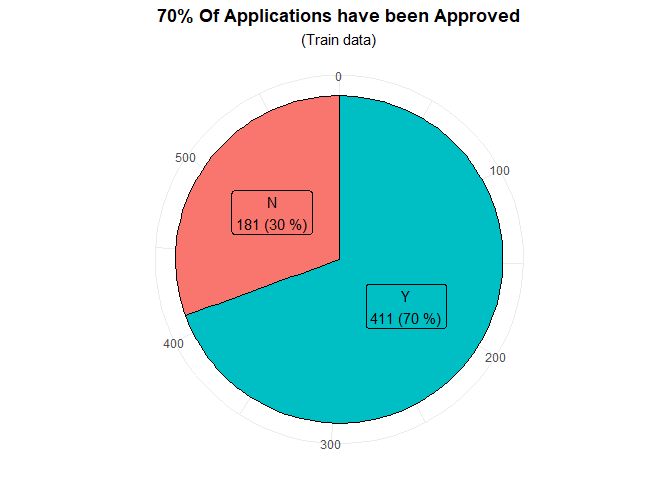
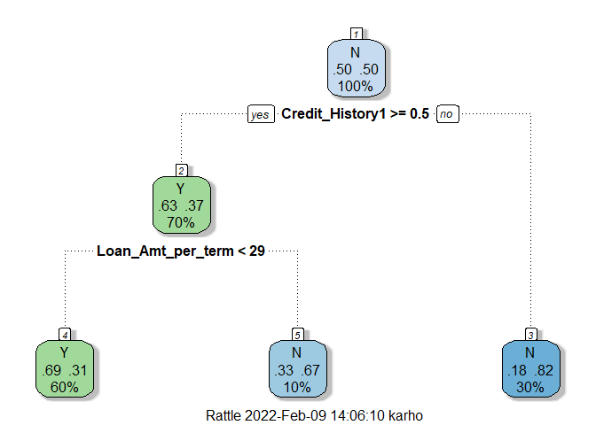
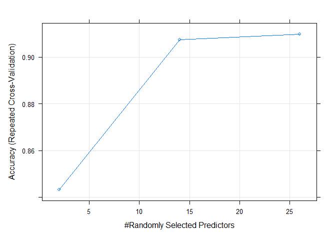

-   [1 SUMMARY](#1-summary)
-   [2 R PACKAGES](#2-r-packages)
-   [3 INTRODUCTION](#3-introduction)
-   [4 DATA PREPARATION](#4-data-preparation)
    -   [4.1 Data import](#41-data-import)
    -   [4.2 Data exploration](#42-data-exploration)
-   [5 DATA CLEANING AND
    MANIPULATION](#5-data-cleaning-and-manipulation)
    -   [5.1 Train.data](#51-traindata)
        -   [5.1.1 Removing ID and factor
            conversion](#511-removing-id-and-factor-conversion)
        -   [5.1.2 Replacing NA](#512-replacing-na)
    -   [5.2 Test data](#52-test-data)
        -   [5.1.1 Remove ID and factor
            conversion](#511-remove-id-and-factor-conversion)
        -   [5.1.2 Replacing NA](#512-replacing-na-1)
    -   [5.3 Feature Engineering](#53-feature-engineering)
-   [6 EXPLORATORY DATA ANALYSIS
    (EDA)](#6-exploratory-data-analysis-eda)
    -   [6.1 Overall Approval Rate](#61-overall-approval-rate)
    -   [6.2 Would Gender affect Loan
        Approval](#62-would-gender-affect-loan-approval)
    -   [6.3 Income and Loan Approval](#63-income-and-loan-approval)
    -   [6.4 Number of incomers](#64-number-of-incomers)
    -   [6.5 Marrital Status, Depedents and
        Education](#65-marrital-status-depedents-and-education)
    -   [6.6 Credit\_History, Property\_Area,
        Self\_Employed](#66-credit_history-property_area-self_employed)
    -   [6.7 EDA summary](#67-eda-summary)
-   [7 MACHINE LEARNING](#7-machine-learning)
    -   [7.1 Data partitioning](#71-data-partitioning)
    -   [7.2 Handling Data Imbalance](#72-handling-data-imbalance)
    -   [7.3 About Modeling](#73-about-modeling)
    -   [7.4 Logistic Regression](#74-logistic-regression)
    -   [7.5 Tree Models](#75-tree-models)
        -   [7.5.1 Decision Tree Model](#751-decision-tree-model)
        -   [7.5.2 Bagging model](#752-bagging-model)
        -   [7.5.3 Random Forest](#753-random-forest)
        -   [7.5.4 XgbTree](#754-xgbtree)
    -   [7.6 Variable Importance](#76-variable-importance)
    -   [7.7 Final Prediction](#77-final-prediction)
-   [8 CONCLUSION](#8-conclusion)
-   [9 REFERENCE](#9-reference)

------------------------------------------------------------------------

title: “Loan EDA and Machine Learning Prediction” author: “Kar Ng” date:
“1/24/2022” output: github\_document: toc: true toc\_depth: 4
always\_allow\_html: yes

------------------------------------------------------------------------

------------------------------------------------------------------------


------------------------------------------------------------------------

## 1 SUMMARY

This project studies the effects of various loan-related variables and
their effect on loan approval. These variables include gender, marital
status, number of dependents, education level, employment status,
applicant’s income, co-applicant’s income, loan amount, loan amount
term, credit history, and property area. In feature engineering, three
new variables were synthesised. They are total income (combination of
applicant and co-applicant incomes), loan per month (loan amount /
term), and whether the number of income providers in an application.

Exploratory data analysis shown that credit history is the most
important variable. It found that 80% of approved applicants had credit
history compared to 20% approved applicants did not have credit history.
Some other minor trends included that (1) there are more male applicants
than female but both gender have equal acceptance rate, (2) higher
education level may help a little with a 8% more in approved
application, (3) a married relationship may also help a little with also
a 9% more in approved application, and (4) if an application has two
incomes (from both applicant + co-applicant), the application may get a
higher chance to be approved (40% more approved applications had
dual-income).

Many models were built to search for the best model to make prediction
on an unknown dataset. This project built a logistic regression model
and many tree-based models included decision tree, bagging, random
forest, and tuned extreme gradient boosting models. There was data
unbalance problem in the dataset, and “Both-sampling” was applied to
under-sample “Y” and over-sample “N” in the responding variable
“Loan-Status” to solve the data unbalance problem.

In statistical modeling, random forest model with ROC-suggested
probability “Y” cutoff point at 0.523 outperformed all other models. The
random forest model has an accuracy rate of 77.4%, a “No Information
rate” lower than the minimum point of 95% CI, and the model had the
smallest gap between sensitivity and specificity, both at 80.5% and
70.3%. Random forest Important plots suggests that positive credit
history is most important variable (supporting EDA), followed by
applicant income, total income, loan amount per term, and credit history
with level “Not sure”.

The random forest model with 0.523 probability “Y” cutoff point was
applied to prediction loan application outcome on an unknown dataset。
The model predicted that 63% of application should be “Y” (at 80.5% of
chance) and 37% of application should be “N” (at 70.3% of chance).

**Insights**


## 2 R PACKAGES

Following R packages are loaded.

``` r
library(tidyverse)
library(skimr)
library(caret)
library(kableExtra)
library(glmnet)
library(MASS)
library(pROC)
library(rpart)
library(rpart.plot)
library(rattle)   # plot tree from caret
library(ggrepel)
library(ROSE)
```

## 3 INTRODUCTION

This project uses datasets from
[Kaggle.com](https://www.kaggle.com/altruistdelhite04/loan-prediction-problem-dataset)
that are related to loan application. *Kaggle.com* is a popular website
for data science community.

This project will study variables that are potentially related to loan
application such as gender, marital status, number of dependents,
education level, self employment, applicant income, co-applicant income,
loan amount, loan amount term, credit history, and area of respondents’
property.

Exploratory data analysis will be applied to study the general trends
between these variables with the outcome variable “loan status”.
Statistical modeling will also be applied to study the data and to
extract statistical important variables. Many models will be built and
the best model will be used to predict application outcome of an unknown
dataset.

Two datasets are given, one is named ‘train.data’ and the another named
‘test.data’. Both datasets have same information but only the train.data
has application outcome variable named ‘loan status’, which contains the
loan results with either “Y” or “N”.

During modeling, I will split the “train.data” into two smaller
datasets, one is named **“train.set”** and another named **“test.set”**.
The **train.set** will be used to make various models and the
**test.set** will be used to evaluate these models. Finally, the best
model will be applied to predict application outcome of the test.data
dataset.

## 4 DATA PREPARATION

Data is downloaded from the
[Kaggle](https://www.kaggle.com/altruistdelhite04/loan-prediction-problem-dataset).
Two datasets are downloaded, a train.data and a test.data dataset.

### 4.1 Data import

``` r
train.data <- read.csv("train_loan.csv", na.strings = c("", "NA"))
test.data <- read.csv("test_loan.csv", na.strings = c("", "NA"))
```

### 4.2 Data exploration

There are 13 variables for the train.data and 12 variables for the
test.data. Both dataset have similar variable, but as mentioned, only
the train.data has the application outcome “Loan\_Status”. The test.data
is the dataset that requiring me to make application outcome prediction.

Following is the first 6 rows of the train.data and the test.data.

``` r
head(train.data)
```

    ##    Loan_ID Gender Married Dependents    Education Self_Employed ApplicantIncome
    ## 1 LP001002   Male      No          0     Graduate            No            5849
    ## 2 LP001003   Male     Yes          1     Graduate            No            4583
    ## 3 LP001005   Male     Yes          0     Graduate           Yes            3000
    ## 4 LP001006   Male     Yes          0 Not Graduate            No            2583
    ## 5 LP001008   Male      No          0     Graduate            No            6000
    ## 6 LP001011   Male     Yes          2     Graduate           Yes            5417
    ##   CoapplicantIncome LoanAmount Loan_Amount_Term Credit_History Property_Area
    ## 1                 0         NA              360              1         Urban
    ## 2              1508        128              360              1         Rural
    ## 3                 0         66              360              1         Urban
    ## 4              2358        120              360              1         Urban
    ## 5                 0        141              360              1         Urban
    ## 6              4196        267              360              1         Urban
    ##   Loan_Status
    ## 1           Y
    ## 2           N
    ## 3           Y
    ## 4           Y
    ## 5           Y
    ## 6           Y

``` r
head(test.data)
```

    ##    Loan_ID Gender Married Dependents    Education Self_Employed ApplicantIncome
    ## 1 LP001015   Male     Yes          0     Graduate            No            5720
    ## 2 LP001022   Male     Yes          1     Graduate            No            3076
    ## 3 LP001031   Male     Yes          2     Graduate            No            5000
    ## 4 LP001035   Male     Yes          2     Graduate            No            2340
    ## 5 LP001051   Male      No          0 Not Graduate            No            3276
    ## 6 LP001054   Male     Yes          0 Not Graduate           Yes            2165
    ##   CoapplicantIncome LoanAmount Loan_Amount_Term Credit_History Property_Area
    ## 1                 0        110              360              1         Urban
    ## 2              1500        126              360              1         Urban
    ## 3              1800        208              360              1         Urban
    ## 4              2546        100              360             NA         Urban
    ## 5                 0         78              360              1         Urban
    ## 6              3422        152              360              1         Urban

**Structural Analysis**

Train.data dataset:

``` r
str(train.data)
```

    ## 'data.frame':    614 obs. of  13 variables:
    ##  $ Loan_ID          : chr  "LP001002" "LP001003" "LP001005" "LP001006" ...
    ##  $ Gender           : chr  "Male" "Male" "Male" "Male" ...
    ##  $ Married          : chr  "No" "Yes" "Yes" "Yes" ...
    ##  $ Dependents       : chr  "0" "1" "0" "0" ...
    ##  $ Education        : chr  "Graduate" "Graduate" "Graduate" "Not Graduate" ...
    ##  $ Self_Employed    : chr  "No" "No" "Yes" "No" ...
    ##  $ ApplicantIncome  : int  5849 4583 3000 2583 6000 5417 2333 3036 4006 12841 ...
    ##  $ CoapplicantIncome: num  0 1508 0 2358 0 ...
    ##  $ LoanAmount       : int  NA 128 66 120 141 267 95 158 168 349 ...
    ##  $ Loan_Amount_Term : int  360 360 360 360 360 360 360 360 360 360 ...
    ##  $ Credit_History   : int  1 1 1 1 1 1 1 0 1 1 ...
    ##  $ Property_Area    : chr  "Urban" "Rural" "Urban" "Urban" ...
    ##  $ Loan_Status      : chr  "Y" "N" "Y" "Y" ...

Test.data dataset:

``` r
str(test.data)
```

    ## 'data.frame':    367 obs. of  12 variables:
    ##  $ Loan_ID          : chr  "LP001015" "LP001022" "LP001031" "LP001035" ...
    ##  $ Gender           : chr  "Male" "Male" "Male" "Male" ...
    ##  $ Married          : chr  "Yes" "Yes" "Yes" "Yes" ...
    ##  $ Dependents       : chr  "0" "1" "2" "2" ...
    ##  $ Education        : chr  "Graduate" "Graduate" "Graduate" "Graduate" ...
    ##  $ Self_Employed    : chr  "No" "No" "No" "No" ...
    ##  $ ApplicantIncome  : int  5720 3076 5000 2340 3276 2165 2226 3881 13633 2400 ...
    ##  $ CoapplicantIncome: int  0 1500 1800 2546 0 3422 0 0 0 2400 ...
    ##  $ LoanAmount       : int  110 126 208 100 78 152 59 147 280 123 ...
    ##  $ Loan_Amount_Term : int  360 360 360 360 360 360 360 360 240 360 ...
    ##  $ Credit_History   : int  1 1 1 NA 1 1 1 0 1 1 ...
    ##  $ Property_Area    : chr  "Urban" "Urban" "Urban" "Urban" ...

-   There are 614 observations (rows) in the train.data dataset and 367
    observations in the test.data dataset.  
-   The last variable ‘Loan\_status’ of train.data dataset has two
    levels either ‘Y’ or ‘N’ to indicate application outcome of an
    applicant.  
-   The ‘Loan\_Amount\_Term’ is the length of time a loan is to be
    completely paid off. This variable has repeated levels. For example,
    there are many 360. It may indicate that this variable has
    categorical nature and should be converted in factor type.

**NA Analysis**

To detect missing values (NA),

-   In the train.data,
    -   There are 8 character and 5 numerical variables.
    -   The dataset is quite complete (checking on the **n\_missing**
        and **complete\_rate**).  
    -   There are many variables with a few missing values, and they
        have complete\_rate higher 90%.  
    -   The variable **Credit\_History** is either 1 or 0, which is a
        binary variable and should be converted into factor during data
        cleaning.

``` r
skim_without_charts(train.data)
```

<table style="width: auto;" class="table table-condensed">
<caption>
Data summary
</caption>
<thead>
<tr>
<th style="text-align:left;">
</th>
<th style="text-align:left;">
</th>
</tr>
</thead>
<tbody>
<tr>
<td style="text-align:left;">
Name
</td>
<td style="text-align:left;">
train.data
</td>
</tr>
<tr>
<td style="text-align:left;">
Number of rows
</td>
<td style="text-align:left;">
614
</td>
</tr>
<tr>
<td style="text-align:left;">
Number of columns
</td>
<td style="text-align:left;">
13
</td>
</tr>
<tr>
<td style="text-align:left;">
\_\_\_\_\_\_\_\_\_\_\_\_\_\_\_\_\_\_\_\_\_\_\_
</td>
<td style="text-align:left;">
</td>
</tr>
<tr>
<td style="text-align:left;">
Column type frequency:
</td>
<td style="text-align:left;">
</td>
</tr>
<tr>
<td style="text-align:left;">
character
</td>
<td style="text-align:left;">
8
</td>
</tr>
<tr>
<td style="text-align:left;">
numeric
</td>
<td style="text-align:left;">
5
</td>
</tr>
<tr>
<td style="text-align:left;">
\_\_\_\_\_\_\_\_\_\_\_\_\_\_\_\_\_\_\_\_\_\_\_\_
</td>
<td style="text-align:left;">
</td>
</tr>
<tr>
<td style="text-align:left;">
Group variables
</td>
<td style="text-align:left;">
None
</td>
</tr>
</tbody>
</table>

**Variable type: character**

<table>
<thead>
<tr>
<th style="text-align:left;">
skim\_variable
</th>
<th style="text-align:right;">
n\_missing
</th>
<th style="text-align:right;">
complete\_rate
</th>
<th style="text-align:right;">
min
</th>
<th style="text-align:right;">
max
</th>
<th style="text-align:right;">
empty
</th>
<th style="text-align:right;">
n\_unique
</th>
<th style="text-align:right;">
whitespace
</th>
</tr>
</thead>
<tbody>
<tr>
<td style="text-align:left;">
Loan\_ID
</td>
<td style="text-align:right;">
0
</td>
<td style="text-align:right;">
1.00
</td>
<td style="text-align:right;">
8
</td>
<td style="text-align:right;">
8
</td>
<td style="text-align:right;">
0
</td>
<td style="text-align:right;">
614
</td>
<td style="text-align:right;">
0
</td>
</tr>
<tr>
<td style="text-align:left;">
Gender
</td>
<td style="text-align:right;">
13
</td>
<td style="text-align:right;">
0.98
</td>
<td style="text-align:right;">
4
</td>
<td style="text-align:right;">
6
</td>
<td style="text-align:right;">
0
</td>
<td style="text-align:right;">
2
</td>
<td style="text-align:right;">
0
</td>
</tr>
<tr>
<td style="text-align:left;">
Married
</td>
<td style="text-align:right;">
3
</td>
<td style="text-align:right;">
1.00
</td>
<td style="text-align:right;">
2
</td>
<td style="text-align:right;">
3
</td>
<td style="text-align:right;">
0
</td>
<td style="text-align:right;">
2
</td>
<td style="text-align:right;">
0
</td>
</tr>
<tr>
<td style="text-align:left;">
Dependents
</td>
<td style="text-align:right;">
15
</td>
<td style="text-align:right;">
0.98
</td>
<td style="text-align:right;">
1
</td>
<td style="text-align:right;">
2
</td>
<td style="text-align:right;">
0
</td>
<td style="text-align:right;">
4
</td>
<td style="text-align:right;">
0
</td>
</tr>
<tr>
<td style="text-align:left;">
Education
</td>
<td style="text-align:right;">
0
</td>
<td style="text-align:right;">
1.00
</td>
<td style="text-align:right;">
8
</td>
<td style="text-align:right;">
12
</td>
<td style="text-align:right;">
0
</td>
<td style="text-align:right;">
2
</td>
<td style="text-align:right;">
0
</td>
</tr>
<tr>
<td style="text-align:left;">
Self\_Employed
</td>
<td style="text-align:right;">
32
</td>
<td style="text-align:right;">
0.95
</td>
<td style="text-align:right;">
2
</td>
<td style="text-align:right;">
3
</td>
<td style="text-align:right;">
0
</td>
<td style="text-align:right;">
2
</td>
<td style="text-align:right;">
0
</td>
</tr>
<tr>
<td style="text-align:left;">
Property\_Area
</td>
<td style="text-align:right;">
0
</td>
<td style="text-align:right;">
1.00
</td>
<td style="text-align:right;">
5
</td>
<td style="text-align:right;">
9
</td>
<td style="text-align:right;">
0
</td>
<td style="text-align:right;">
3
</td>
<td style="text-align:right;">
0
</td>
</tr>
<tr>
<td style="text-align:left;">
Loan\_Status
</td>
<td style="text-align:right;">
0
</td>
<td style="text-align:right;">
1.00
</td>
<td style="text-align:right;">
1
</td>
<td style="text-align:right;">
1
</td>
<td style="text-align:right;">
0
</td>
<td style="text-align:right;">
2
</td>
<td style="text-align:right;">
0
</td>
</tr>
</tbody>
</table>

**Variable type: numeric**

<table>
<thead>
<tr>
<th style="text-align:left;">
skim\_variable
</th>
<th style="text-align:right;">
n\_missing
</th>
<th style="text-align:right;">
complete\_rate
</th>
<th style="text-align:right;">
mean
</th>
<th style="text-align:right;">
sd
</th>
<th style="text-align:right;">
p0
</th>
<th style="text-align:right;">
p25
</th>
<th style="text-align:right;">
p50
</th>
<th style="text-align:right;">
p75
</th>
<th style="text-align:right;">
p100
</th>
</tr>
</thead>
<tbody>
<tr>
<td style="text-align:left;">
ApplicantIncome
</td>
<td style="text-align:right;">
0
</td>
<td style="text-align:right;">
1.00
</td>
<td style="text-align:right;">
5403.46
</td>
<td style="text-align:right;">
6109.04
</td>
<td style="text-align:right;">
150
</td>
<td style="text-align:right;">
2877.5
</td>
<td style="text-align:right;">
3812.5
</td>
<td style="text-align:right;">
5795.00
</td>
<td style="text-align:right;">
81000
</td>
</tr>
<tr>
<td style="text-align:left;">
CoapplicantIncome
</td>
<td style="text-align:right;">
0
</td>
<td style="text-align:right;">
1.00
</td>
<td style="text-align:right;">
1621.25
</td>
<td style="text-align:right;">
2926.25
</td>
<td style="text-align:right;">
0
</td>
<td style="text-align:right;">
0.0
</td>
<td style="text-align:right;">
1188.5
</td>
<td style="text-align:right;">
2297.25
</td>
<td style="text-align:right;">
41667
</td>
</tr>
<tr>
<td style="text-align:left;">
LoanAmount
</td>
<td style="text-align:right;">
22
</td>
<td style="text-align:right;">
0.96
</td>
<td style="text-align:right;">
146.41
</td>
<td style="text-align:right;">
85.59
</td>
<td style="text-align:right;">
9
</td>
<td style="text-align:right;">
100.0
</td>
<td style="text-align:right;">
128.0
</td>
<td style="text-align:right;">
168.00
</td>
<td style="text-align:right;">
700
</td>
</tr>
<tr>
<td style="text-align:left;">
Loan\_Amount\_Term
</td>
<td style="text-align:right;">
14
</td>
<td style="text-align:right;">
0.98
</td>
<td style="text-align:right;">
342.00
</td>
<td style="text-align:right;">
65.12
</td>
<td style="text-align:right;">
12
</td>
<td style="text-align:right;">
360.0
</td>
<td style="text-align:right;">
360.0
</td>
<td style="text-align:right;">
360.00
</td>
<td style="text-align:right;">
480
</td>
</tr>
<tr>
<td style="text-align:left;">
Credit\_History
</td>
<td style="text-align:right;">
50
</td>
<td style="text-align:right;">
0.92
</td>
<td style="text-align:right;">
0.84
</td>
<td style="text-align:right;">
0.36
</td>
<td style="text-align:right;">
0
</td>
<td style="text-align:right;">
1.0
</td>
<td style="text-align:right;">
1.0
</td>
<td style="text-align:right;">
1.00
</td>
<td style="text-align:right;">
1
</td>
</tr>
</tbody>
</table>

-   The same situation goes to the test.data dataset.

``` r
skim_without_charts(test.data)
```

<table style="width: auto;" class="table table-condensed">
<caption>
Data summary
</caption>
<thead>
<tr>
<th style="text-align:left;">
</th>
<th style="text-align:left;">
</th>
</tr>
</thead>
<tbody>
<tr>
<td style="text-align:left;">
Name
</td>
<td style="text-align:left;">
test.data
</td>
</tr>
<tr>
<td style="text-align:left;">
Number of rows
</td>
<td style="text-align:left;">
367
</td>
</tr>
<tr>
<td style="text-align:left;">
Number of columns
</td>
<td style="text-align:left;">
12
</td>
</tr>
<tr>
<td style="text-align:left;">
\_\_\_\_\_\_\_\_\_\_\_\_\_\_\_\_\_\_\_\_\_\_\_
</td>
<td style="text-align:left;">
</td>
</tr>
<tr>
<td style="text-align:left;">
Column type frequency:
</td>
<td style="text-align:left;">
</td>
</tr>
<tr>
<td style="text-align:left;">
character
</td>
<td style="text-align:left;">
7
</td>
</tr>
<tr>
<td style="text-align:left;">
numeric
</td>
<td style="text-align:left;">
5
</td>
</tr>
<tr>
<td style="text-align:left;">
\_\_\_\_\_\_\_\_\_\_\_\_\_\_\_\_\_\_\_\_\_\_\_\_
</td>
<td style="text-align:left;">
</td>
</tr>
<tr>
<td style="text-align:left;">
Group variables
</td>
<td style="text-align:left;">
None
</td>
</tr>
</tbody>
</table>

**Variable type: character**

<table>
<thead>
<tr>
<th style="text-align:left;">
skim\_variable
</th>
<th style="text-align:right;">
n\_missing
</th>
<th style="text-align:right;">
complete\_rate
</th>
<th style="text-align:right;">
min
</th>
<th style="text-align:right;">
max
</th>
<th style="text-align:right;">
empty
</th>
<th style="text-align:right;">
n\_unique
</th>
<th style="text-align:right;">
whitespace
</th>
</tr>
</thead>
<tbody>
<tr>
<td style="text-align:left;">
Loan\_ID
</td>
<td style="text-align:right;">
0
</td>
<td style="text-align:right;">
1.00
</td>
<td style="text-align:right;">
8
</td>
<td style="text-align:right;">
8
</td>
<td style="text-align:right;">
0
</td>
<td style="text-align:right;">
367
</td>
<td style="text-align:right;">
0
</td>
</tr>
<tr>
<td style="text-align:left;">
Gender
</td>
<td style="text-align:right;">
11
</td>
<td style="text-align:right;">
0.97
</td>
<td style="text-align:right;">
4
</td>
<td style="text-align:right;">
6
</td>
<td style="text-align:right;">
0
</td>
<td style="text-align:right;">
2
</td>
<td style="text-align:right;">
0
</td>
</tr>
<tr>
<td style="text-align:left;">
Married
</td>
<td style="text-align:right;">
0
</td>
<td style="text-align:right;">
1.00
</td>
<td style="text-align:right;">
2
</td>
<td style="text-align:right;">
3
</td>
<td style="text-align:right;">
0
</td>
<td style="text-align:right;">
2
</td>
<td style="text-align:right;">
0
</td>
</tr>
<tr>
<td style="text-align:left;">
Dependents
</td>
<td style="text-align:right;">
10
</td>
<td style="text-align:right;">
0.97
</td>
<td style="text-align:right;">
1
</td>
<td style="text-align:right;">
2
</td>
<td style="text-align:right;">
0
</td>
<td style="text-align:right;">
4
</td>
<td style="text-align:right;">
0
</td>
</tr>
<tr>
<td style="text-align:left;">
Education
</td>
<td style="text-align:right;">
0
</td>
<td style="text-align:right;">
1.00
</td>
<td style="text-align:right;">
8
</td>
<td style="text-align:right;">
12
</td>
<td style="text-align:right;">
0
</td>
<td style="text-align:right;">
2
</td>
<td style="text-align:right;">
0
</td>
</tr>
<tr>
<td style="text-align:left;">
Self\_Employed
</td>
<td style="text-align:right;">
23
</td>
<td style="text-align:right;">
0.94
</td>
<td style="text-align:right;">
2
</td>
<td style="text-align:right;">
3
</td>
<td style="text-align:right;">
0
</td>
<td style="text-align:right;">
2
</td>
<td style="text-align:right;">
0
</td>
</tr>
<tr>
<td style="text-align:left;">
Property\_Area
</td>
<td style="text-align:right;">
0
</td>
<td style="text-align:right;">
1.00
</td>
<td style="text-align:right;">
5
</td>
<td style="text-align:right;">
9
</td>
<td style="text-align:right;">
0
</td>
<td style="text-align:right;">
3
</td>
<td style="text-align:right;">
0
</td>
</tr>
</tbody>
</table>

**Variable type: numeric**

<table>
<thead>
<tr>
<th style="text-align:left;">
skim\_variable
</th>
<th style="text-align:right;">
n\_missing
</th>
<th style="text-align:right;">
complete\_rate
</th>
<th style="text-align:right;">
mean
</th>
<th style="text-align:right;">
sd
</th>
<th style="text-align:right;">
p0
</th>
<th style="text-align:right;">
p25
</th>
<th style="text-align:right;">
p50
</th>
<th style="text-align:right;">
p75
</th>
<th style="text-align:right;">
p100
</th>
</tr>
</thead>
<tbody>
<tr>
<td style="text-align:left;">
ApplicantIncome
</td>
<td style="text-align:right;">
0
</td>
<td style="text-align:right;">
1.00
</td>
<td style="text-align:right;">
4805.60
</td>
<td style="text-align:right;">
4910.69
</td>
<td style="text-align:right;">
0
</td>
<td style="text-align:right;">
2864.00
</td>
<td style="text-align:right;">
3786
</td>
<td style="text-align:right;">
5060.0
</td>
<td style="text-align:right;">
72529
</td>
</tr>
<tr>
<td style="text-align:left;">
CoapplicantIncome
</td>
<td style="text-align:right;">
0
</td>
<td style="text-align:right;">
1.00
</td>
<td style="text-align:right;">
1569.58
</td>
<td style="text-align:right;">
2334.23
</td>
<td style="text-align:right;">
0
</td>
<td style="text-align:right;">
0.00
</td>
<td style="text-align:right;">
1025
</td>
<td style="text-align:right;">
2430.5
</td>
<td style="text-align:right;">
24000
</td>
</tr>
<tr>
<td style="text-align:left;">
LoanAmount
</td>
<td style="text-align:right;">
5
</td>
<td style="text-align:right;">
0.99
</td>
<td style="text-align:right;">
136.13
</td>
<td style="text-align:right;">
61.37
</td>
<td style="text-align:right;">
28
</td>
<td style="text-align:right;">
100.25
</td>
<td style="text-align:right;">
125
</td>
<td style="text-align:right;">
158.0
</td>
<td style="text-align:right;">
550
</td>
</tr>
<tr>
<td style="text-align:left;">
Loan\_Amount\_Term
</td>
<td style="text-align:right;">
6
</td>
<td style="text-align:right;">
0.98
</td>
<td style="text-align:right;">
342.54
</td>
<td style="text-align:right;">
65.16
</td>
<td style="text-align:right;">
6
</td>
<td style="text-align:right;">
360.00
</td>
<td style="text-align:right;">
360
</td>
<td style="text-align:right;">
360.0
</td>
<td style="text-align:right;">
480
</td>
</tr>
<tr>
<td style="text-align:left;">
Credit\_History
</td>
<td style="text-align:right;">
29
</td>
<td style="text-align:right;">
0.92
</td>
<td style="text-align:right;">
0.83
</td>
<td style="text-align:right;">
0.38
</td>
<td style="text-align:right;">
0
</td>
<td style="text-align:right;">
1.00
</td>
<td style="text-align:right;">
1
</td>
<td style="text-align:right;">
1.0
</td>
<td style="text-align:right;">
1
</td>
</tr>
</tbody>
</table>

## 5 DATA CLEANING AND MANIPULATION

### 5.1 Train.data

#### 5.1.1 Removing ID and factor conversion

First, I will remove the “Loan\_ID” and convert all character variables
into factor because they are categorical variables. LOan\_ID will be
removed because it adds no value for prediction.

Converting variables into factors will help the analysis because it
gives the data a grouping features which will enable useful R functions
and useful visualisation in later stage.

``` r
train.data <- train.data %>% 
  dplyr::select(-Loan_ID) %>%                                    # Remove Loan_ID 
  mutate_if(is_character, as.factor) %>%                  # Convert all character into factor.
  mutate(Credit_History = as.factor(Credit_History),      # Convert Credit_History into factor.
         Loan_Amount_Term = as.factor(Loan_Amount_Term))  # Convert Loan_Amount_Term into factor.
```

After converting categorical variables into factor, following function
help to summarise the dataset.

``` r
summary(train.data)
```

    ##     Gender    Married    Dependents        Education   Self_Employed
    ##  Female:112   No  :213   0   :345   Graduate    :480   No  :500     
    ##  Male  :489   Yes :398   1   :102   Not Graduate:134   Yes : 82     
    ##  NA's  : 13   NA's:  3   2   :101                      NA's: 32     
    ##                          3+  : 51                                   
    ##                          NA's: 15                                   
    ##                                                                     
    ##                                                                     
    ##  ApplicantIncome CoapplicantIncome   LoanAmount    Loan_Amount_Term
    ##  Min.   :  150   Min.   :    0     Min.   :  9.0   360    :512     
    ##  1st Qu.: 2878   1st Qu.:    0     1st Qu.:100.0   180    : 44     
    ##  Median : 3812   Median : 1188     Median :128.0   480    : 15     
    ##  Mean   : 5403   Mean   : 1621     Mean   :146.4   300    : 13     
    ##  3rd Qu.: 5795   3rd Qu.: 2297     3rd Qu.:168.0   84     :  4     
    ##  Max.   :81000   Max.   :41667     Max.   :700.0   (Other): 12     
    ##                                    NA's   :22      NA's   : 14     
    ##  Credit_History   Property_Area Loan_Status
    ##  0   : 89       Rural    :179   N:192      
    ##  1   :475       Semiurban:233   Y:422      
    ##  NA's: 50       Urban    :202              
    ##                                            
    ##                                            
    ##                                            
    ## 

Many variables have missing values, as denoted by “NA’s”. Missing values
will be filled up in next section.

#### 5.1.2 Replacing NA

Following codes replace all the NAs with respective mode. “Mode” is the
most occurring category of a variable. It is a decision made after
carefully examining its feasibility, these missing values are less than
5%, and their respective most occurring category have frequencies that
are way higher than the rest of the categories. Therefore, it is highly
likely that these NAs may belong to the most occurring category.

``` r
train.data <- train.data %>% 
  mutate(Gender = replace_na(Gender, "Male"),
         Married = replace_na(Married, "Yes"),
         Dependents = replace_na(Dependents, '0'),
         Self_Employed = replace_na(Self_Employed, 'No'),
         Loan_Amount_Term = replace_na(Loan_Amount_Term, '360'))
  
summary(train.data)
```

    ##     Gender    Married   Dependents        Education   Self_Employed
    ##  Female:112   No :213   0 :360     Graduate    :480   No :532      
    ##  Male  :502   Yes:401   1 :102     Not Graduate:134   Yes: 82      
    ##                         2 :101                                     
    ##                         3+: 51                                     
    ##                                                                    
    ##                                                                    
    ##                                                                    
    ##  ApplicantIncome CoapplicantIncome   LoanAmount    Loan_Amount_Term
    ##  Min.   :  150   Min.   :    0     Min.   :  9.0   360    :526     
    ##  1st Qu.: 2878   1st Qu.:    0     1st Qu.:100.0   180    : 44     
    ##  Median : 3812   Median : 1188     Median :128.0   480    : 15     
    ##  Mean   : 5403   Mean   : 1621     Mean   :146.4   300    : 13     
    ##  3rd Qu.: 5795   3rd Qu.: 2297     3rd Qu.:168.0   84     :  4     
    ##  Max.   :81000   Max.   :41667     Max.   :700.0   240    :  4     
    ##                                    NA's   :22      (Other):  8     
    ##  Credit_History   Property_Area Loan_Status
    ##  0   : 89       Rural    :179   N:192      
    ##  1   :475       Semiurban:233   Y:422      
    ##  NA's: 50       Urban    :202              
    ##                                            
    ##                                            
    ##                                            
    ## 

**Credit History**

Regarding the NA in the variable “credit history”, I found that the 50
NA is too many (8%) and is quite close to the 89 observations of the
category “0” (mean no credit history). I decided to make a new level
named “Not sure” to these “Na”

``` r
50/(89+475+50) 
```

    ## [1] 0.08143322

``` r
train.data <- train.data %>% 
  mutate(Credit_History = as.character(Credit_History),
         Credit_History = replace_na(Credit_History, "Not_sure"),
         Credit_History = as.factor(Credit_History))
```

Now, the variable “Credit History” has following category (or known as
“level”) and respective counts.

``` r
summary(train.data$Credit_History)
```

    ##        0        1 Not_sure 
    ##       89      475       50

**LoanAmount**

For the variable “LoanAmount”, there are 22 missing values out of 614
rows of data (3.5%). I will remove these missing values. According to
Schafer (1999), the paper asserted that a missing rate of 5% or less is
inconsequential.

``` r
22/614 * 100
```

    ## [1] 3.583062

``` r
train.data <- train.data %>% na.omit()
```

### 5.2 Test data

#### 5.1.1 Remove ID and factor conversion

Applying the same data processing techniques in the train.data dataset
to test.data dataset.

``` r
test.data <- test.data %>% 
  dplyr::select(-Loan_ID) %>%                                    # Remove Loan_ID 
  mutate_if(is_character, as.factor) %>%                  # Convert all character into factor.
  mutate(Credit_History = as.factor(Credit_History),      # Convert Credit_History into factor.
         Loan_Amount_Term = as.factor(Loan_Amount_Term))  # Convert Loan_Amount_Term into factor.

summary(test.data)
```

    ##     Gender    Married   Dependents        Education   Self_Employed
    ##  Female: 70   No :134   0   :200   Graduate    :283   No  :307     
    ##  Male  :286   Yes:233   1   : 58   Not Graduate: 84   Yes : 37     
    ##  NA's  : 11             2   : 59                      NA's: 23     
    ##                         3+  : 40                                   
    ##                         NA's: 10                                   
    ##                                                                    
    ##                                                                    
    ##  ApplicantIncome CoapplicantIncome   LoanAmount    Loan_Amount_Term
    ##  Min.   :    0   Min.   :    0     Min.   : 28.0   360    :311     
    ##  1st Qu.: 2864   1st Qu.:    0     1st Qu.:100.2   180    : 22     
    ##  Median : 3786   Median : 1025     Median :125.0   480    :  8     
    ##  Mean   : 4806   Mean   : 1570     Mean   :136.1   300    :  7     
    ##  3rd Qu.: 5060   3rd Qu.: 2430     3rd Qu.:158.0   240    :  4     
    ##  Max.   :72529   Max.   :24000     Max.   :550.0   (Other):  9     
    ##                                    NA's   :5       NA's   :  6     
    ##  Credit_History   Property_Area
    ##  0   : 59       Rural    :111  
    ##  1   :279       Semiurban:116  
    ##  NA's: 29       Urban    :140  
    ##                                
    ##                                
    ##                                
    ## 

#### 5.1.2 Replacing NA

``` r
test.data <- test.data %>% 
  mutate(Gender = replace_na(Gender, "Male"),
         Dependents = replace_na(Dependents, '0'),
         Self_Employed = replace_na(Self_Employed, 'No'),
         Loan_Amount_Term = replace_na(Loan_Amount_Term, '360'))
  
summary(test.data)
```

    ##     Gender    Married   Dependents        Education   Self_Employed
    ##  Female: 70   No :134   0 :210     Graduate    :283   No :330      
    ##  Male  :297   Yes:233   1 : 58     Not Graduate: 84   Yes: 37      
    ##                         2 : 59                                     
    ##                         3+: 40                                     
    ##                                                                    
    ##                                                                    
    ##                                                                    
    ##  ApplicantIncome CoapplicantIncome   LoanAmount    Loan_Amount_Term
    ##  Min.   :    0   Min.   :    0     Min.   : 28.0   360    :317     
    ##  1st Qu.: 2864   1st Qu.:    0     1st Qu.:100.2   180    : 22     
    ##  Median : 3786   Median : 1025     Median :125.0   480    :  8     
    ##  Mean   : 4806   Mean   : 1570     Mean   :136.1   300    :  7     
    ##  3rd Qu.: 5060   3rd Qu.: 2430     3rd Qu.:158.0   240    :  4     
    ##  Max.   :72529   Max.   :24000     Max.   :550.0   84     :  3     
    ##                                    NA's   :5       (Other):  6     
    ##  Credit_History   Property_Area
    ##  0   : 59       Rural    :111  
    ##  1   :279       Semiurban:116  
    ##  NA's: 29       Urban    :140  
    ##                                
    ##                                
    ##                                
    ## 

**Credit History**

For credit history, I will transfer 29 of “NA” to “1”, because it is
very likely that all these 29 NA are actually 1 because 1 is the most
occurring category of that variable and outnumbering “0”.

``` r
test.data <- test.data %>% 
  mutate(Credit_History = as.character(Credit_History),
         Credit_History = replace_na(Credit_History, "1"),
         Credit_History = as.factor(Credit_History))

summary(test.data)
```

    ##     Gender    Married   Dependents        Education   Self_Employed
    ##  Female: 70   No :134   0 :210     Graduate    :283   No :330      
    ##  Male  :297   Yes:233   1 : 58     Not Graduate: 84   Yes: 37      
    ##                         2 : 59                                     
    ##                         3+: 40                                     
    ##                                                                    
    ##                                                                    
    ##                                                                    
    ##  ApplicantIncome CoapplicantIncome   LoanAmount    Loan_Amount_Term
    ##  Min.   :    0   Min.   :    0     Min.   : 28.0   360    :317     
    ##  1st Qu.: 2864   1st Qu.:    0     1st Qu.:100.2   180    : 22     
    ##  Median : 3786   Median : 1025     Median :125.0   480    :  8     
    ##  Mean   : 4806   Mean   : 1570     Mean   :136.1   300    :  7     
    ##  3rd Qu.: 5060   3rd Qu.: 2430     3rd Qu.:158.0   240    :  4     
    ##  Max.   :72529   Max.   :24000     Max.   :550.0   84     :  3     
    ##                                    NA's   :5       (Other):  6     
    ##  Credit_History   Property_Area
    ##  0: 59          Rural    :111  
    ##  1:308          Semiurban:116  
    ##                 Urban    :140  
    ##                                
    ##                                
    ##                                
    ## 

**Loan Amount**

There are only 5 NA in the variable, I will remove these missing values.

``` r
test.data <- test.data %>% 
  na.omit()
```

### 5.3 Feature Engineering

**On Train.data**

This section creates 3 new variables based on original variables.

1.  total\_income (Applicant Income + Co-applicant income)

This is synthesised by adding “ApplicantIncome” and “CoapplicantIncome”
to find the total income of an application.

``` r
train.data <- train.data %>% 
  mutate(total_income = ApplicantIncome + CoapplicantIncome) %>% 
  relocate(total_income, .after = CoapplicantIncome)
```

2.  Loan\_Amt\_per\_term (Loan/month)

This is synthesised by dividing “LoanAmount” with “Loan\_Amount\_Term”
to find out would the loan amount with the unit of per month would
affect the approval of a loan application.

``` r
train.data <- train.data %>% 
  mutate(Loan_Amt_per_term = round(LoanAmount/as.numeric(Loan_Amount_Term), 2)) %>% 
  relocate(Loan_Amt_per_term, .after = Loan_Amount_Term)
```

3.  Income provider (one incomer or two)

This variable is created based on the numbers of incomers in an
application. Two levels have been detected for this new variable:

-   “Applicant”: Only the primary applicant has income

-   “Both”: Both the primary applicant and co-applicant have incomes

``` r
train.data <- train.data %>% 
  mutate(Income_provider = case_when(CoapplicantIncome == 0 ~ "Applicant",
                                     ApplicantIncome == 0 ~ "Co-applicant",
                                     TRUE ~ "Both"),
         Income_provider = as.factor(Income_provider)) %>% 
  relocate(Income_provider, .after = total_income)
```

**On Test.data**

The same operation applies to test.data.

1.  total\_income

``` r
test.data <- test.data %>% 
  mutate(total_income = ApplicantIncome + CoapplicantIncome) %>% 
  relocate(total_income, .after = CoapplicantIncome)
```

2.  Loan\_Amt\_per\_term

``` r
test.data <- test.data %>% 
  mutate(Loan_Amt_per_term = round(LoanAmount/as.numeric(Loan_Amount_Term), 2)) %>% 
  relocate(Loan_Amt_per_term, .after = Loan_Amount_Term)
```

3.  Income provider (one incomer or two)

``` r
test.data <- test.data %>% 
  mutate(Income_provider = case_when(CoapplicantIncome == 0 ~ "Applicant",
                                     ApplicantIncome == 0 ~ "Co-applicant",
                                     TRUE ~ "Both"),
         Income_provider = as.factor(Income_provider)) %>% 
  relocate(Income_provider, .after = total_income)
```

## 6 EXPLORATORY DATA ANALYSIS (EDA)

In this section, I will use the **train.data** dataset to analyse
general trends in the dataset because **train.data** has the outcome
variable “Loan\_Status”. The relationship between Loan\_Status with all
variables in the dataset will be investigated.

``` r
names(train.data)
```

    ##  [1] "Gender"            "Married"           "Dependents"       
    ##  [4] "Education"         "Self_Employed"     "ApplicantIncome"  
    ##  [7] "CoapplicantIncome" "total_income"      "Income_provider"  
    ## [10] "LoanAmount"        "Loan_Amount_Term"  "Loan_Amt_per_term"
    ## [13] "Credit_History"    "Property_Area"     "Loan_Status"

This exploratory data analysis will help to understand the general
trends in the data before getting into machine learning.

### 6.1 Overall Approval Rate

Most of the applications from the train dataset were approved. 411
applications (70%) were approved, denoted by the symbol “Y”， whereas
181 of applications (30%) were rejected, denoted by “N”.

``` r
# set up dataframe

df6.1 <- train.data %>% 
  dplyr::select(Loan_Status) %>% 
  group_by(Loan_Status) %>% 
  summarise(count = n()) %>% 
  ungroup() %>% 
  mutate(total = sum(count),
         per = round(count/total, 1))

# plot

ggplot(df6.1, aes(x = "", y = count, fill = Loan_Status)) +
  geom_bar(stat = 'identity', colour = "black") +
  coord_polar(theta = "y", start = 0) +
  theme_minimal() +
  theme(axis.title = element_blank(),
        legend.position = "none",
        plot.title = element_text(hjust = 0.5,
                                  face = "bold"),
        plot.subtitle = element_text(hjust = 0.5)) +
  geom_label(aes(label = paste0(Loan_Status, "\n", count, " (", per*100, " %)")),
             position = position_stack(vjust = 0.5),
             size = 4) +
  labs(title = "70% Of Applications have been Approved",
       subtitle = "(Train data)")  
```

<!-- -->

It is an unbalanced dataset because the number of observations in both
categories are different from each other in a large scale, and which may
cause problem in machine learning. In section 7.2, a technique will be
used to address this data unbalanced problem.

### 6.2 Would Gender affect Loan Approval

Results show that:

-   There are lesser female applicants (109) than male applicants (483).

-   However, the loan success rate of both gender are the same, both
    arrived at 70%.

``` r
# set up dataframe

df6.2 <- train.data %>% 
  dplyr::select(Loan_Status, Gender) %>% 
  group_by(Loan_Status, Gender) %>% 
  summarise(count = n()) %>% 
  ungroup() %>% 
  group_by(Gender) %>% 
  mutate(total = sum(count),
         per = round(count/total, 1))

# plot

ggplot(df6.2, aes(x = "", y = count, fill = Loan_Status)) +
  geom_bar(stat = 'identity', colour = "black") +
  coord_polar(theta = "y", start = 0) +
  theme_minimal() +
  theme(axis.title = element_blank(),
        legend.position = "none",
        plot.title = element_text(hjust = 0.5,
                                  face = "bold"),
        plot.subtitle = element_text(hjust = 0.5)) +
  geom_label(aes(label = paste0(Loan_Status, "\n", count, " (", per*100, " %)")),
             position = position_stack(vjust = 0.5),
             size = 3) +
  labs(title = "Both Gender have similar proportion",
       subtitle = "(Train data)") +
  facet_wrap(~ Gender)
```

<!-- --> Female
Applicants:

``` r
73+36
```

    ## [1] 109

Male Applicants:

``` r
145+338
```

    ## [1] 483

### 6.3 Income and Loan Approval

There are three type of income categories to be analysed, which are:

-   “ApplicantIncome” - the income of the primary applicant  
-   “CoapplicantIncome” - the income of co-applicant  
-   “total\_income” - the total income of both primary applicant and
    co-applicant

``` r
# set up dataframe

df6.3 <- train.data %>% 
  dplyr::select(ApplicantIncome, CoapplicantIncome, total_income, Loan_Status) %>% 
  pivot_longer(c(1:3), names_to = "cat", values_to = "income") 

# plot

p1 <- ggplot(df6.3, aes(x = Loan_Status, y = income, shape = Loan_Status, colour = Loan_Status)) +
  geom_jitter(alpha = 0.5) + 
  geom_boxplot(alpha = 0,
               outlier.shape = NA,
               color = "black") +
  facet_wrap(~cat) +
  theme_bw() +
  theme(strip.text = element_text(size = 14),
        plot.title = element_text(face = "bold"),
        legend.position = "none") +
  labs(x = "Loan Status",
       title = "Income Category vs Loan Status")

p2 <- ggplot(df6.3, aes(x = Loan_Status, y = log(income), shape = Loan_Status, colour = Loan_Status)) +
  geom_jitter(alpha = 0.5) + 
  geom_boxplot(alpha = 0,
               outlier.shape = NA,
               color = "black") +
  facet_wrap(~cat) +
  theme_bw() +
  theme(strip.text = element_text(size = 14),
        plot.title = element_text(face = "bold"),
        legend.position = "none")+
  labs(x = "Loan Status",
       title = "Logged Income Category vs Loan Status",
       caption = "total income = applicant income + co-applicant income")

library(ggpubr)

ggarrange(p1, p2, 
          nrow = 2, 
          ncol = 1,
          labels =c("A", "B"))
```

<!-- -->

My hypothesis is that the boxplots of “Y”s should be at a higher
position than all the “N” because applicants in the “Y” had their
application approved and therefore would have higher income.

However, results show that regardless of whether the income is based on
original scale or log transformed,

-   All three income data have no obvious impact on loan approval.  
-   Boxplots of 3 type of incomes “ApplicantIncome”, “CoapplicantIncome”
    and “total\_income” overlap with each other.

It indicates that the criteria of loan approval is not based on income,
at least it is not obvious.

### 6.4 Number of incomers

This section studies the effect of the number of incomers toward the
outcome of a loan application.

The “Applicant” in the graph means that only primary applicant has
income in an application, whereas, “Both” means both primary applicant
and the co-applicant have incomes in an application.

-   From disapproved application (N), there is not much different
    between “Applicant” and “Both”.

-   From approved application (Y), “Both” has more application got
    approved (39% more).

It is a good sign that feature engineering does help in extracting
hidden trend in the data.

``` r
# set up data frame

df6.4 <- train.data %>% 
  dplyr::select(Income_provider, Loan_Status) %>% 
  group_by(Income_provider, Loan_Status) %>% 
  summarise(count = n()) %>% 
  mutate(lab = paste0(Income_provider, "\n(n =", count, ")"))
```

    ## `summarise()` has grouped output by 'Income_provider'. You can override using the `.groups` argument.

``` r
# plot

ggplot(df6.4, aes(x = lab, y = count, fill = Income_provider)) +
  geom_bar(stat = "identity") +
  geom_text(aes(label = count), vjust = 1.5) +
  facet_wrap(~ Loan_Status, scale = "free_x") +
  theme_bw() +
  theme(strip.text = element_text(size = 14),
        plot.title = element_text(face = "bold"),
        legend.position = "top",
        axis.title.x = element_text(margin = margin(8, 0, 0, 0)),
        axis.title.y = element_text(margin = margin(0, 8, 0, 0))) +
  labs(x = "Loan Status",
       y = "Applicant Count",
       title = "Dual-incomers Help Loan Approval Positively (Y)")
```

<!-- --> In the
approved application “Y”, there are 38.95% more application in the
“Both” group got their application approved.

``` r
(239-172)/172 *100
```

    ## [1] 38.95349

### 6.5 Marrital Status, Depedents and Education

This section studies the effect of marital status, numbers of
dependents, and education levels of an applicant on his/her loan status
in the train.data dataset.

Results show that:

-   There is no obvious trend for the number of dependents on loan
    approval.  
-   8% more applicants with graduate education level had their loan
    application approved.  
-   9% more applicants with a married status had their loan approved.

``` r
# set up df

df6.5 <- train.data %>% 
  dplyr::select(Married, Dependents, Education, Loan_Status) %>% 
  pivot_longer(c(1:3), names_to = "variables", values_to = "values") %>% 
  group_by(Loan_Status, variables, values) %>% 
  summarise(count = n()) %>% 
  ungroup() %>% 
  group_by(variables, values) %>% 
  mutate(total = sum(count),
         per = paste0(round(count/total,2)*100, "%"),
         lab = paste0(values, "\n", "n = (", total, ")"))
```

    ## `summarise()` has grouped output by 'Loan_Status', 'variables'. You can override using the `.groups` argument.

``` r
# plot

ggplot(df6.5, aes(x = lab, y = count, fill = Loan_Status)) +
  geom_histogram(stat = "identity", position = "fill") +
  facet_wrap(~variables, scale = "free") +  
  theme_bw() +
  theme(strip.text = element_text(size = 14),
        plot.title = element_text(face = "bold"),
        legend.position = "top",
        axis.title.x = element_text(margin = margin(8, 0, 0, 0)))+
  labs(x = "Loan Status",
       y = " ",
       title = "Dependents, Education, and Marrital Status on Loan Status") +
  geom_label(aes(label = per), 
             position = "fill", 
             vjust = 2) 
```

    ## Warning: Ignoring unknown parameters: binwidth, bins, pad

<!-- -->

### 6.6 Credit\_History, Property\_Area, Self\_Employed

Insights show that:

-   If an applicant does not have credit history, 90% of the chance that
    his/her application would be rejected. Credit history will help
    tremendous in getting loan application approved.

-   There are 3 different types of property area, semi-urban has the
    highest approval rate (77%), followed by urban at 68%, and lastly
    semi-urban at 62%.

-   Self-employment would not have relation with loan approval.

``` r
# Set up dataframe

df6.6 <- train.data %>% 
  dplyr::select(Self_Employed, Credit_History, Property_Area, Loan_Status) %>% 
  pivot_longer(c(1:3), names_to = "variables", values_to = "values") %>% 
  group_by(Loan_Status, variables, values) %>% 
  summarise(count = n()) %>% 
  ungroup() %>% 
  group_by(variables, values) %>% 
  mutate(total = sum(count),
         per = paste0(round(count/total,2)*100, "%"),
         lab = paste0(values, "\n", "n = (", total, ")"))
```

    ## `summarise()` has grouped output by 'Loan_Status', 'variables'. You can override using the `.groups` argument.

``` r
# plot

ggplot(df6.6, aes(x = lab, y = count, fill = Loan_Status)) +
  geom_histogram(stat = "identity", position = "fill") +
  facet_wrap(~variables, scale = "free") +  
  theme_bw() +
  theme(strip.text = element_text(size = 14),
        plot.title = element_text(face = "bold"),
        legend.position = "top",
        axis.title.x = element_text(margin = margin(8, 0, 0, 0)))+
  labs(x = "Loan Status",
       y = " ",
       title = "Self-Employed, Credit History, and Property Area on Loan Status") +
  geom_label(aes(label = per), 
             position = "fill", 
             vjust = 1.5) 
```

    ## Warning: Ignoring unknown parameters: binwidth, bins, pad

<!-- -->

### 6.7 EDA summary

From the exploratory data analysis, there are some visual trends in
education status, marital status and property area that they may impact
the approval of a loan application. Credit history had the largest
impact on loan application outcome.

Apart from the above visualisation analysis, Statistical modeling
(machine learning) will be carried out next to help extract inner trends
in the data and ultimately build an effective model to predict
application outcome of the imported test.data dataset.

## 7 MACHINE LEARNING

### 7.1 Data partitioning

There are two datasets imported, the **train.data** and the
**test.data**. However, only the **train.data** dataset has the
responding variable **“Loan\_Status”**. Therefore, my strategies will be
(a common machine learning technique):

-   Split the train.data dataset into proportioned **train.set** and
    **test.set**. This **test.set** will be used to assess models built
    from the **train.set**.

-   The best model will be used to predict the **test.data**.

There are several ratio options for data partitioning, such as 50:50,
60:40, or 80:20 to split the data into train and test set. Most popular
ratios are 40:60, 30:70, and 20:80, and usually the 30:70 is popular
because it is in the “middle” position.

However, data partitioning is largely depends on how much data we have.
If dataset is sufficiently big, results yield from different
partitioning ratio may be similar. In small dataset such as the dataset
in this project, We should try our best to ensure there is enough data
to train an effective model as well as enough data for the test set to
assess the performance of the model.

I am going for 70:30 split of the train.data into train.set and test.set
to ensure there is sufficient data for both of the datasets.

``` r
set.seed(123)

# Data partitioning

ind <- train.data$Loan_Status %>% createDataPartition(list = F, p = 0.7)

# train test split

train.set <- train.data[ind, ]
test.set <- train.data[-ind, ]
```

The train.data is a small dataset consisting only 592 rows of
observation, and data partition splits it into:

-   70% train.set with 415 rows of observation and,  
-   30% of test.set with 177 rows of observation.

Data size of **train.set**:

``` r
dim(train.set)[1]
```

    ## [1] 415

Data size of **test.set**:

``` r
dim(test.set)[1]
```

    ## [1] 177

The test set has 54 and 123 of “N” and “Y”. I have a concern that the
sample size for “N” might be insufficient and would cause low
specificity. If it is the case I would need to try out other partitions
such as 60:40 instead of current 30:70. Anyway, it will be detected in
later stage.

``` r
table(test.set$Loan_Status)
```

    ## 
    ##   N   Y 
    ##  54 123

### 7.2 Handling Data Imbalance

As discussed, this dataset has class imbalance problem. Approximately
30% of the data in the responding variable is made up of “N”, and 70%
for “Y”. It means that there is less data for models to learn to
classify “N”.

Accuracy rate calculated in later section would be misleading because it
could be dominated by “Y”. Technically, it means a high level in
accuracy rate, a high level in sensitivity but a low level in
specificity. This project put equal weight on sensitivity and
specificity, and therefore a model with similar accuracy rate,
sensitivity and specificity is desired.

``` r
127/(127+288)*100
```

    ## [1] 30.60241

To solve this data unbalance problem, there are 4 techniques:

1.  *Over-sampling*: Increase the sample size of “N” by randomly repeat
    some of the existing data.  
2.  *Under-sampling*: Reduce the sample size of “Y” to the sample size
    of “N”. Some data of “Y” will be lost.  
3.  *Both-sampling*: It uses over-sampling and under-sampling to a
    dataset and make a balanced size between both “Y” and “N” group.  
4.  *ROSE*: Create any desired sample size by synthesising artificial
    data. However, some misleading data would need to be handled. For
    example, the minimum of age is 0, but it could be a negative value
    if ROSE is applied. Therefore, Data needs to be checked and cleaned
    if ROSE is applied.

``` r
set.seed(123)

over_train <- ovun.sample(Loan_Status~., data = train.set, method = "over", N = 288*2)$data  # 288 is the major group in the binary
under_train <- ovun.sample(Loan_Status~., data = train.set, method = "under", N = 127*2)$data  # it reduces "Y"'s 288 samples to 127.
both_train <- ovun.sample(Loan_Status ~., data = train.set, method = "both", N = 415)$data # total samples of train set
rose_train <- ROSE(Loan_Status ~., data = train.set, N = 500)$data
```

From my experience, the method “both” (combination of over-sampling and
under-sampling) generally worked well, and this technique will be used
in this project.

``` r
table(both_train$Loan_Status)
```

    ## 
    ##   Y   N 
    ## 207 208

-   The “N” had 127 observations, and it has been increased to 208 by
    re-sampling. In re-sampling, it increases the sample size by
    randomly repeating some of the existing information.
-   The “Y” had 288 observations, and it has been reduced to 207 with
    some information lost.  
-   The ratio of N:Y has now been improved from approximately 30:70 to
    approximately 50:50.

### 7.3 About Modeling

It should be aware that no model is 100% accurate in machine learning.
Generally, different models from different appropriate algorithms are
built and the best model is searched and used to predict an unknown
dataset.

### 7.4 Logistic Regression

This project faces a binary / binomial problem which means the
responding variable has only 2 group, such as yes or no. Logistic
regression will be applied. For logistic regression, it is not required
to test the linear relationship between predictors and the responding
variable, and therefore the normality of error terms.

Following show the results of a binomial logistic regression model with
a 10-fold cross validation (cv) and a cv repetition of 3 times.

``` r
model_logistic <- train(Loan_Status ~ ., 
                        data = both_train,
                        method = "glm",
                        family = "binomial",
                        trControl = trainControl(method = "repeatedcv",
                                                 number = 10,
                                                 repeats = 3))

summary(model_logistic)
```

    ## 
    ## Call:
    ## NULL
    ## 
    ## Deviance Residuals: 
    ##      Min        1Q    Median        3Q       Max  
    ## -2.45383  -0.75986   0.00015   0.72715   1.98706  
    ## 
    ## Coefficients: (2 not defined because of singularities)
    ##                           Estimate Std. Error z value Pr(>|z|)    
    ## (Intercept)              4.663e+00  1.103e+00   4.228 2.35e-05 ***
    ## GenderMale              -7.861e-01  3.822e-01  -2.057 0.039699 *  
    ## MarriedYes               1.051e+00  3.222e-01   3.261 0.001109 ** 
    ## Dependents1              2.900e-01  4.157e-01   0.698 0.485394    
    ## Dependents2             -9.386e-01  4.135e-01  -2.270 0.023208 *  
    ## `Dependents3+`           3.368e-01  4.643e-01   0.725 0.468214    
    ## `EducationNot Graduate`  6.580e-01  3.409e-01   1.930 0.053559 .  
    ## Self_EmployedYes        -4.646e-01  3.768e-01  -1.233 0.217563    
    ## ApplicantIncome          5.930e-05  4.194e-05   1.414 0.157361    
    ## CoapplicantIncome        1.517e-04  7.627e-05   1.989 0.046653 *  
    ## total_income                    NA         NA      NA       NA    
    ## Income_providerBoth     -5.869e-01  3.524e-01  -1.665 0.095839 .  
    ## LoanAmount              -5.120e-03  1.979e-02  -0.259 0.795804    
    ## Loan_Amount_Term36       1.429e+01  9.989e+02   0.014 0.988586    
    ## Loan_Amount_Term60      -1.923e+01  1.294e+03  -0.015 0.988142    
    ## Loan_Amount_Term84      -2.648e+00  4.301e+00  -0.616 0.538084    
    ## Loan_Amount_Term120     -1.637e+01  1.197e+03  -0.014 0.989087    
    ## Loan_Amount_Term180     -1.512e+00  1.703e+00  -0.888 0.374744    
    ## Loan_Amount_Term240     -1.709e+01  2.400e+03  -0.007 0.994317    
    ## Loan_Amount_Term300     -1.023e+00  1.296e+00  -0.789 0.429978    
    ## Loan_Amount_Term360     -1.422e+00  8.691e-01  -1.636 0.101834    
    ## Loan_Amount_Term480             NA         NA      NA       NA    
    ## Loan_Amt_per_term        6.090e-02  1.795e-01   0.339 0.734456    
    ## Credit_History1         -3.810e+00  4.922e-01  -7.739 1.00e-14 ***
    ## Credit_HistoryNot_sure  -4.289e+00  6.926e-01  -6.192 5.93e-10 ***
    ## Property_AreaSemiurban  -1.265e+00  3.286e-01  -3.850 0.000118 ***
    ## Property_AreaUrban      -5.824e-01  3.234e-01  -1.801 0.071734 .  
    ## ---
    ## Signif. codes:  0 '***' 0.001 '**' 0.01 '*' 0.05 '.' 0.1 ' ' 1
    ## 
    ## (Dispersion parameter for binomial family taken to be 1)
    ## 
    ##     Null deviance: 575.31  on 414  degrees of freedom
    ## Residual deviance: 388.46  on 390  degrees of freedom
    ## AIC: 438.46
    ## 
    ## Number of Fisher Scoring iterations: 15

**Insights**

-   Results show that variable **total\_income** and the level “480” in
    the variable **Loan\_Amount\_per\_term** are redundant because all
    other variable have provided sufficient information in explaining
    the variability in the responding variables.

-   The model shows that most variables are not significantly related to
    the loan status (which is the outcome variable), except for **gender
    (male), marital Status (yes), dependents (2), co-applicant Income,
    credit history (1 & not sure) and property area (semi-urban)**.
    These are statistically important variables that is said to have
    real effect (Will not have 0 effect, but can be negative) on the
    approval of loan, though they are statistically significant, but
    their effects are subjected to their coefficient estimates (log odd)
    and one’s significant effect sometime might be too small to have a
    decisive impact.

A new logistic model is built with only significant variables as below.

``` r
model_logistic <- train(Loan_Status ~ Gender + Married + Dependents + CoapplicantIncome + Credit_History + Property_Area, 
                        data = both_train,
                        method = "glm",
                        family = "binomial",
                        trControl = trainControl(method = "repeatedcv",
                                                 number = 10,
                                                 repeats = 3))

summary(model_logistic)
```

    ## 
    ## Call:
    ## NULL
    ## 
    ## Deviance Residuals: 
    ##     Min       1Q   Median       3Q      Max  
    ## -2.4602  -0.9216   0.1605   0.9931   1.9696  
    ## 
    ## Coefficients:
    ##                          Estimate Std. Error z value Pr(>|z|)    
    ## (Intercept)             3.638e+00  5.641e-01   6.449 1.12e-10 ***
    ## GenderMale             -6.612e-01  3.474e-01  -1.903 0.057013 .  
    ## MarriedYes              6.320e-01  2.768e-01   2.283 0.022438 *  
    ## Dependents1             3.827e-01  3.604e-01   1.062 0.288209    
    ## Dependents2            -9.202e-01  3.834e-01  -2.400 0.016395 *  
    ## `Dependents3+`          4.765e-01  4.242e-01   1.123 0.261318    
    ## CoapplicantIncome       7.121e-05  3.482e-05   2.045 0.040817 *  
    ## Credit_History1        -3.602e+00  4.671e-01  -7.712 1.24e-14 ***
    ## Credit_HistoryNot_sure -3.855e+00  6.279e-01  -6.140 8.26e-10 ***
    ## Property_AreaSemiurban -9.864e-01  2.886e-01  -3.418 0.000631 ***
    ## Property_AreaUrban     -6.171e-01  2.898e-01  -2.130 0.033209 *  
    ## ---
    ## Signif. codes:  0 '***' 0.001 '**' 0.01 '*' 0.05 '.' 0.1 ' ' 1
    ## 
    ## (Dispersion parameter for binomial family taken to be 1)
    ## 
    ##     Null deviance: 575.31  on 414  degrees of freedom
    ## Residual deviance: 430.08  on 404  degrees of freedom
    ## AIC: 452.08
    ## 
    ## Number of Fisher Scoring iterations: 5

**Receiver Operating Characteristics Curve (ROC)**

A ROC curve is plotted to search for the optimum AUC (area under the
curve) that would give rise to the best sensitivity, specificity and the
probability cutoff point.

``` r
# Prediction on test.data

pred_logistic <- model_logistic %>% predict(test.set, type = 'prob') 

# ROC curve

roc_logistic <- roc(test.set$Loan_Status,   
               pred_logistic[, 1])      # first column is "Y"        
```

    ## Setting levels: control = N, case = Y

    ## Setting direction: controls < cases

``` r
plot.roc(roc_logistic, 
         print.auc = T, 
         print.thres = T,
         auc.polygon = T,
         auc.polygon.col = "green",
         max.auc.polygon = T,
         main = "ROC - Logistic")
```

<!-- --> **Insights**

-   The higher the AUC, the better the model. The diagonal line is where
    AUC is equal to 0.5, it is where the binary classification is based
    on random chance.  
-   AUC values of 0.756 is considered a good because it is higher than
    0.5.  
-   The best probability cutoff point suggested by this ROC with this
    AUC is 0.380. It will be a probability cutoff point that any
    observation above this point will be classified as “Y”.

**Prediction with test data**

Start prediction based on the probability cutoff point 0.380.

``` r
# Set up data frame

CM_logistic <- pred_logistic %>% 
  dplyr::select(Y) %>% 
  mutate(result_based0.38 = ifelse(Y > 0.38, "Y", "N"),
         result_based0.38 = as.factor(result_based0.38))

# Confusion Matrix

confusionMatrix(CM_logistic$result_based0.38,
                test.set$Loan_Status,
                positive = "Y")
```

    ## Confusion Matrix and Statistics
    ## 
    ##           Reference
    ## Prediction   N   Y
    ##          N  26   3
    ##          Y  28 120
    ##                                           
    ##                Accuracy : 0.8249          
    ##                  95% CI : (0.7607, 0.8778)
    ##     No Information Rate : 0.6949          
    ##     P-Value [Acc > NIR] : 5.891e-05       
    ##                                           
    ##                   Kappa : 0.5253          
    ##                                           
    ##  Mcnemar's Test P-Value : 1.629e-05       
    ##                                           
    ##             Sensitivity : 0.9756          
    ##             Specificity : 0.4815          
    ##          Pos Pred Value : 0.8108          
    ##          Neg Pred Value : 0.8966          
    ##              Prevalence : 0.6949          
    ##          Detection Rate : 0.6780          
    ##    Detection Prevalence : 0.8362          
    ##       Balanced Accuracy : 0.7285          
    ##                                           
    ##        'Positive' Class : Y               
    ## 

This model has a very good accuracy rate at 82.5% but in above case,
this accuracy rate is very miss-leading because it can only correctly
predicting “Y” at 97.6% (sensitivity) and when predicting “N”, the
accuracy drops to only 48% (specificity).

Let’s try out the default 0.5 cut-off point, it is the default
classification cut-off point if ROC is not generated for the best
suggested probability cutoff point. The default 0.5 generally works well
but ROC’s probability cutoff point is generally recommended.

``` r
pred_logistic <- model_logistic %>% predict(test.set, type = 'raw') 


confusionMatrix(pred_logistic,
                test.set$Loan_Status,
                positive = "Y")
```

    ## Warning in confusionMatrix.default(pred_logistic, test.set$Loan_Status, : Levels
    ## are not in the same order for reference and data. Refactoring data to match.

    ## Confusion Matrix and Statistics
    ## 
    ##           Reference
    ## Prediction  N  Y
    ##          N 33 26
    ##          Y 21 97
    ##                                          
    ##                Accuracy : 0.7345         
    ##                  95% CI : (0.663, 0.7979)
    ##     No Information Rate : 0.6949         
    ##     P-Value [Acc > NIR] : 0.1440         
    ##                                          
    ##                   Kappa : 0.3896         
    ##                                          
    ##  Mcnemar's Test P-Value : 0.5596         
    ##                                          
    ##             Sensitivity : 0.7886         
    ##             Specificity : 0.6111         
    ##          Pos Pred Value : 0.8220         
    ##          Neg Pred Value : 0.5593         
    ##              Prevalence : 0.6949         
    ##          Detection Rate : 0.5480         
    ##    Detection Prevalence : 0.6667         
    ##       Balanced Accuracy : 0.6999         
    ##                                          
    ##        'Positive' Class : Y              
    ## 

The default probability cutoff point of 0.5 is a better point to be used
in this case.

Though the accuracy rate drops from 82.5% to 73.4%, but the gap between
sensitivity and specificity become much smaller. In other words, the
accuracy rate of correctly predicting “N” increased at the trade-off of
sensitivity. The overall accuracy rate become less miss-leading.

The accuracy rate is also higher than the “No Information Rate” of 69%,
but it’s 95% CI has cover the no information rate. It indicates that
there is a chance that this model can be useless. “No information rate”
is the chance of getting “Y” when the classification is made based on
random chance.

One may say the probability cut-off point of 0.38 is better because it
has higher rate for accuracy and sensitivity, however, whether a model
is good or bad is largely depends on the purpose of the prediction. If
predicting “Y” is more important in a project than predicting “N” then
the model with probability point of 0.38 is better than the 0.5 cutoff
point.

However, there is no specific purpose in this project specifying which
sensitivity or specificity need to be emphasized and so I will be
choosing the model that has somehow equal sensitivity and specificity
(or closer gap).

Therefore, in logistic regression, 0.5 cutoff point is much better.

### 7.5 Tree Models

4 type of tree models will be built in this section, which are:

-   Decision Tree  
-   Bootstrap Aggregating (Bagging)
-   Random Forest
-   Extreme Gradient Boosting

#### 7.5.1 Decision Tree Model

A decision tree model is built. It is a popular non-parametric algorithm
that can handle missing data (though I have handled them), and is immune
to multicollinearity and outliers. It is a method usually built for
quick understanding of the variables and their effects on the outcome.

Decision tree continuously splits the data into 2 and repeatedly until
maximum homogeneity within the new parts are achieved. The entire
structure is like a upside-down tree with most important variables being
located at the top, and there are decision rules in each split to help
making classification.

**Model building**

``` r
set.seed(123)

model_dt <- train(Loan_Status ~., 
                  data = both_train,
                  method = "rpart",
                  trControl = trainControl(method = 'repeatedcv', 
                                           number = 10, 
                                           repeats = 3))
model_dt
```

    ## CART 
    ## 
    ## 415 samples
    ##  14 predictor
    ##   2 classes: 'Y', 'N' 
    ## 
    ## No pre-processing
    ## Resampling: Cross-Validated (10 fold, repeated 3 times) 
    ## Summary of sample sizes: 373, 373, 374, 373, 374, 375, ... 
    ## Resampling results across tuning parameters:
    ## 
    ##   cp          Accuracy   Kappa    
    ##   0.03381643  0.7099555  0.4203565
    ##   0.07246377  0.6891221  0.3786055
    ##   0.37681159  0.5518486  0.1092959
    ## 
    ## Accuracy was used to select the optimal model using the largest value.
    ## The final value used for the model was cp = 0.03381643.

A decision tree model is built and 0.0338 is suggested the best CP. CP
is a value to limit the size of a decision tree and the default is 0.01.
The default CP level generally can do a good job however the optimum one
is generally generated and will be automatically selected by the model.

From following graph, CP at 0.0338 has the highest accuracy.

``` r
plot(model_dt)
```

<!-- -->

This decision tree model has following decision rules:

``` r
model_dt$finalModel
```

    ## n= 415 
    ## 
    ## node), split, n, loss, yval, (yprob)
    ##       * denotes terminal node
    ## 
    ## 1) root 415 207 N (0.4987952 0.5012048)  
    ##   2) Credit_History1>=0.5 290 106 Y (0.6344828 0.3655172)  
    ##     4) Loan_Amt_per_term< 28.5 247  77 Y (0.6882591 0.3117409) *
    ##     5) Loan_Amt_per_term>=28.5 43  14 N (0.3255814 0.6744186) *
    ##   3) Credit_History1< 0.5 125  23 N (0.1840000 0.8160000) *

The "\*" means that branch is a terminal node.

Following is a better, as well a typical representation of a decision
tree. The root node with the most important variable is located at the
top, and each split will create two branches and two root nodes. Nodes
at the very based are terminal node where the splitting stops. During
each split, decision roles will be made available.

The tree helps us to make decision. For examples, if an observation has
credit history of 0, it will be directed to “No” at the root node, and
it will be classified as disapproved case “N” by 82% of chance. This
concept is the same to the left direction where the result is leading to
“Y”.

``` r
rattle::fancyRpartPlot(model_dt$finalModel)
```

<!-- --> **Receiver
Operating Characteristics Curve (ROC)**

Similar to logistic regression, ROC is also applied to find its
suggested probability cutoff point to be used for prediction.

``` r
# prediction on test set

pred_dt <- model_dt %>% predict(test.set, type = "prob")


# ROC curve

roc_dt <- roc(test.set$Loan_Status, 
              pred_dt[, 1])       # Picking "Y"
```

    ## Setting levels: control = N, case = Y

    ## Setting direction: controls < cases

``` r
plot.roc(roc_dt,
         print.auc = T,
         print.thres = T,
         auc.polygon = T,
         auc.polygon.col = "green",
         max.auc.polygon = T,
         main = "ROC - Decision Tree")
```

<!-- --> The best
probability cutoff point suggested by ROC for decision tree model to
predict “Y” is 0.255. Any observation above 0.255 will be classified as
“Y”.

**Predictions**

This prediction will be based on the ROC suggested probability cutoff
point 0.255 to determine if an observation is “Y”.

``` r
CM_dt <- pred_dt %>% 
  dplyr::select(Y) %>% 
  mutate(result_based0.745 = ifelse(Y > 0.255, "Y", "N"),
         result_based0.745 = as.factor(result_based0.745))

# Confusion matrix

confusionMatrix(CM_dt$result_based0.745, test.set$Loan_Status, positive = "Y")
```

    ## Confusion Matrix and Statistics
    ## 
    ##           Reference
    ## Prediction   N   Y
    ##          N  28  14
    ##          Y  26 109
    ##                                           
    ##                Accuracy : 0.774           
    ##                  95% CI : (0.7052, 0.8334)
    ##     No Information Rate : 0.6949          
    ##     P-Value [Acc > NIR] : 0.01215         
    ##                                           
    ##                   Kappa : 0.4316          
    ##                                           
    ##  Mcnemar's Test P-Value : 0.08199         
    ##                                           
    ##             Sensitivity : 0.8862          
    ##             Specificity : 0.5185          
    ##          Pos Pred Value : 0.8074          
    ##          Neg Pred Value : 0.6667          
    ##              Prevalence : 0.6949          
    ##          Detection Rate : 0.6158          
    ##    Detection Prevalence : 0.7627          
    ##       Balanced Accuracy : 0.7023          
    ##                                           
    ##        'Positive' Class : Y               
    ## 

The model has fairy high accuracy rate at 77.4% with a rate higher than
“No Information Rate”, it indicates that the model is useful. However,
the probability gives miss-leading accuracy rate, because there is a big
gap between sensitivity and specificity. There is at least 37% different
between sensitivity and specificity.

``` r
 0.8862 - 0.51
```

    ## [1] 0.3762

Let’s try the default 0.5 cutoff point.

``` r
CM_dt2 <- model_dt %>% predict(test.set, type = "raw")

confusionMatrix(CM_dt2, test.set$Loan_Status, positive = "Y")
```

    ## Confusion Matrix and Statistics
    ## 
    ##           Reference
    ## Prediction  N  Y
    ##          N 32 25
    ##          Y 22 98
    ##                                          
    ##                Accuracy : 0.7345         
    ##                  95% CI : (0.663, 0.7979)
    ##     No Information Rate : 0.6949         
    ##     P-Value [Acc > NIR] : 0.1440         
    ##                                          
    ##                   Kappa : 0.3834         
    ##                                          
    ##  Mcnemar's Test P-Value : 0.7705         
    ##                                          
    ##             Sensitivity : 0.7967         
    ##             Specificity : 0.5926         
    ##          Pos Pred Value : 0.8167         
    ##          Neg Pred Value : 0.5614         
    ##              Prevalence : 0.6949         
    ##          Detection Rate : 0.5537         
    ##    Detection Prevalence : 0.6780         
    ##       Balanced Accuracy : 0.6947         
    ##                                          
    ##        'Positive' Class : Y              
    ## 

With the probability cutoff point of 0.5, the gap between sensitivity
and specificity become smaller with a difference at 20.4%. However, it
is still considered a big gap.

``` r
0.7967-0.5926
```

    ## [1] 0.2041

I will take this decision tree as a not-so-good model for prediction.

#### 7.5.2 Bagging model

Now, I am building more than just a single tree by using the “bagging”
method.

The *bagging* stands for “Bootstrap Aggregating”. This method samples
the training set multiple times, randomly with replacement and build
multiple trees. The decision of any classification will be based on the
overall result of all the trees.

**Model building**

Building the model:

``` r
set.seed(123)

model_bag <- train(Loan_Status ~., 
                   data = both_train,
                   method = "treebag",
                   trControl = trainControl(method = "repeatedcv",
                                            number = 10, 
                                            repeats = 3,
                                            allowParallel = T))
model_bag
```

    ## Bagged CART 
    ## 
    ## 415 samples
    ##  14 predictor
    ##   2 classes: 'Y', 'N' 
    ## 
    ## No pre-processing
    ## Resampling: Cross-Validated (10 fold, repeated 3 times) 
    ## Summary of sample sizes: 373, 373, 374, 373, 374, 375, ... 
    ## Resampling results:
    ## 
    ##   Accuracy   Kappa    
    ##   0.8985918  0.7972083

There were 25 bootstrap replications involved in this algorithm.

``` r
model_bag$finalModel
```

    ## 
    ## Bagging classification trees with 25 bootstrap replications

**Receiver Operating Characteristics Curve (ROC)**

This is to find the best Probability cut off point to be used for
prediction.

``` r
# prediction

predict_bag <- model_bag %>% predict(test.set, type = "prob")

# ROC curve

roc_bag <- roc(test.set$Loan_Status,
               predict_bag[, 1])
```

    ## Setting levels: control = N, case = Y

    ## Setting direction: controls < cases

``` r
plot.roc(roc_bag,
         print.thres = T,
         print.auc = T,
         auc.polygon = T,
         auc.polygon.col = "green",
         max.auc.polygon = T,
         main = "ROC - Bagging")
```

<!-- --> The best
probability cutoff point is suggested to be 0.660. Any observation with
probability above this level will be classified as “Y” by the bagging
model.

``` r
# set up

CM_bag <- predict_bag %>% 
  dplyr::select(Y) %>% 
  mutate(result_based0.3 = ifelse(Y > 0.66, "Y", "N"),
         result_based0.3 = as.factor(result_based0.3))

# Confusion Metrics

confusionMatrix(CM_bag[, 2], 
                test.set$Loan_Status, 
                positive = "Y")
```

    ## Confusion Matrix and Statistics
    ## 
    ##           Reference
    ## Prediction  N  Y
    ##          N 44 39
    ##          Y 10 84
    ##                                          
    ##                Accuracy : 0.7232         
    ##                  95% CI : (0.651, 0.7876)
    ##     No Information Rate : 0.6949         
    ##     P-Value [Acc > NIR] : 0.2328         
    ##                                          
    ##                   Kappa : 0.4326         
    ##                                          
    ##  Mcnemar's Test P-Value : 6.334e-05      
    ##                                          
    ##             Sensitivity : 0.6829         
    ##             Specificity : 0.8148         
    ##          Pos Pred Value : 0.8936         
    ##          Neg Pred Value : 0.5301         
    ##              Prevalence : 0.6949         
    ##          Detection Rate : 0.4746         
    ##    Detection Prevalence : 0.5311         
    ##       Balanced Accuracy : 0.7489         
    ##                                          
    ##        'Positive' Class : Y              
    ## 

**Insights**

-   The model has a good accuracy rate of 72.3% and this is higher than
    the “No information rate” of 69.5%. It indicates that this model is
    useful and perform better than random chance.

-   There is a different between sensitivity and specificity of 13%. It
    is acceptable if there is no other model perform better than this
    value.

``` r
0.81-0.68
```

    ## [1] 0.13

Even the default probability cutoff point of 0.5 has a larger different
between sensitivity and specificity rate at 17% (shown below).
Therefore, for my purpose of searching for a fair, accurate model which
put the same weight on both sensitivity and specificity, the probability
point of 0.66 suggested by ROC is doing a better job.

``` r
# set up

CM_bag2 <- model_bag %>% predict(test.set, type = "raw")

# Confusion Metrics

confusionMatrix(CM_bag2, 
                test.set$Loan_Status, 
                positive = "Y")
```

    ## Warning in confusionMatrix.default(CM_bag2, test.set$Loan_Status, positive =
    ## "Y"): Levels are not in the same order for reference and data. Refactoring data
    ## to match.

    ## Confusion Matrix and Statistics
    ## 
    ##           Reference
    ## Prediction  N  Y
    ##          N 34 24
    ##          Y 20 99
    ##                                          
    ##                Accuracy : 0.7514         
    ##                  95% CI : (0.681, 0.8132)
    ##     No Information Rate : 0.6949         
    ##     P-Value [Acc > NIR] : 0.05846        
    ##                                          
    ##                   Kappa : 0.4257         
    ##                                          
    ##  Mcnemar's Test P-Value : 0.65108        
    ##                                          
    ##             Sensitivity : 0.8049         
    ##             Specificity : 0.6296         
    ##          Pos Pred Value : 0.8319         
    ##          Neg Pred Value : 0.5862         
    ##              Prevalence : 0.6949         
    ##          Detection Rate : 0.5593         
    ##    Detection Prevalence : 0.6723         
    ##       Balanced Accuracy : 0.7173         
    ##                                          
    ##        'Positive' Class : Y              
    ## 

``` r
0.8049-0.6296
```

    ## [1] 0.1753

Again, there is no right or wrong about a model. It depends on the
purpose of the prediction. If the purpose is to predict Y only, then
this model with 0.5 probability cutoff point is certainly a better model
than the model that used the R0C recommended cutoff point at 0.66.

#### 7.5.3 Random Forest

Random forest is one of the powerful machine learning algorithm that
many machine learning practitioners prefer to use.

It is similar to bagging method that build many decisions trees based on
random re-sampling with replacement. 500 tree models will be built in
this random forest model. 500 is the default value but is change-able.
The only difference between random forest and bagging is that random
forest limit each tree in the selection of available variables (or known
as predictors in machine learning).

``` r
set.seed(123)

model_rf <- train(Loan_Status~., 
                  data = both_train,
                  method = "rf",
                  trControl = trainControl(method = "repeatedcv",
                                           number = 10,
                                           repeats = 3, 
                                           allowParallel = T))
model_rf
```

    ## Random Forest 
    ## 
    ## 415 samples
    ##  14 predictor
    ##   2 classes: 'Y', 'N' 
    ## 
    ## No pre-processing
    ## Resampling: Cross-Validated (10 fold, repeated 3 times) 
    ## Summary of sample sizes: 373, 373, 374, 373, 374, 375, ... 
    ## Resampling results across tuning parameters:
    ## 
    ##   mtry  Accuracy   Kappa    
    ##    2    0.8431678  0.6863762
    ##   14    0.9073810  0.8147545
    ##   26    0.9098403  0.8196519
    ## 
    ## Accuracy was used to select the optimal model using the largest value.
    ## The final value used for the model was mtry = 26.

The random forest model says that:

-   It is a classification task
-   500 trees were built
-   It suggests that the optimum number of variables (mtry) at each
    split is 26 and will be used when doing prediction.

``` r
model_rf$finalModel
```

    ## 
    ## Call:
    ##  randomForest(x = x, y = y, mtry = min(param$mtry, ncol(x))) 
    ##                Type of random forest: classification
    ##                      Number of trees: 500
    ## No. of variables tried at each split: 26
    ## 
    ##         OOB estimate of  error rate: 8.43%
    ## Confusion matrix:
    ##     Y   N class.error
    ## Y 191  16  0.07729469
    ## N  19 189  0.09134615

The accuracy is optimum when “mtry” is equal to 26.

``` r
plot(model_rf)
```

<!-- -->

**Receiver Operating Characteristics Curve (ROC)**

ROC is plotted to find the best probability cutoff point to classify
whether an application is “Y” or “N”.

``` r
# prediction
pred_rf <- model_rf %>% predict(test.set, type = "prob")

# ROC curve

ROC_rf <- roc(test.set$Loan_Status,
    pred_rf[, 1])
```

    ## Setting levels: control = N, case = Y

    ## Setting direction: controls < cases

``` r
plot.roc(ROC_rf,
         print.thres = T,
         print.auc = T, 
         auc.polygon = T,
         auc.polygon.col = "green",
         max.auc.polygon = T,
         main = "ROC - Random Forest")
```

<!-- -->

The best probability cutoff points is 0.523, with AUC (area under the
curve) equal to 0.802 which is a value higher than the 50% random
chance. Therefore, it is a useful model that can perform better than
random chance.

``` r
# Set df

CM_rf <- pred_rf %>% 
  dplyr::select(Y) %>% 
  mutate(result_based0.523 = ifelse(Y > 0.523, "Y", "N"),
         result_based0.523 = factor(result_based0.523))

# Confusion matrix

confusionMatrix(CM_rf[, 2], test.set$Loan_Status, positive = "Y")
```

    ## Confusion Matrix and Statistics
    ## 
    ##           Reference
    ## Prediction  N  Y
    ##          N 38 24
    ##          Y 16 99
    ##                                           
    ##                Accuracy : 0.774           
    ##                  95% CI : (0.7052, 0.8334)
    ##     No Information Rate : 0.6949          
    ##     P-Value [Acc > NIR] : 0.01215         
    ##                                           
    ##                   Kappa : 0.4883          
    ##                                           
    ##  Mcnemar's Test P-Value : 0.26838         
    ##                                           
    ##             Sensitivity : 0.8049          
    ##             Specificity : 0.7037          
    ##          Pos Pred Value : 0.8609          
    ##          Neg Pred Value : 0.6129          
    ##              Prevalence : 0.6949          
    ##          Detection Rate : 0.5593          
    ##    Detection Prevalence : 0.6497          
    ##       Balanced Accuracy : 0.7543          
    ##                                           
    ##        'Positive' Class : Y               
    ## 

Random forest is performing superior than other models built previously.

-   This random forest model has the highest accuracy at 77.4%.  
-   This accuracy is higher than the “No Information Rate” at 69.5%.  
-   The “No Information Rate” is outside the 95% CI of 70.5%-83.3%, it
    indicates that the accuracy is significant.  
-   The sensitivity is the highest so far at 80.5%.  
-   The specificity is not the highest but is fairly good at 70.37%.  
-   The gap between sensitivity and specificity is the smallest compared
    to other models built.

Let’s see the performance of default probability cutoff point 0.5 for
random forest model.

``` r
CM_rf2 <- model_rf %>% predict(test.set, type = "raw")

confusionMatrix(CM_rf2, test.set$Loan_Status, positive = "Y")
```

    ## Warning in confusionMatrix.default(CM_rf2, test.set$Loan_Status, positive =
    ## "Y"): Levels are not in the same order for reference and data. Refactoring data
    ## to match.

    ## Confusion Matrix and Statistics
    ## 
    ##           Reference
    ## Prediction  N  Y
    ##          N 35 24
    ##          Y 19 99
    ##                                          
    ##                Accuracy : 0.7571         
    ##                  95% CI : (0.687, 0.8183)
    ##     No Information Rate : 0.6949         
    ##     P-Value [Acc > NIR] : 0.04113        
    ##                                          
    ##                   Kappa : 0.4416         
    ##                                          
    ##  Mcnemar's Test P-Value : 0.54187        
    ##                                          
    ##             Sensitivity : 0.8049         
    ##             Specificity : 0.6481         
    ##          Pos Pred Value : 0.8390         
    ##          Neg Pred Value : 0.5932         
    ##              Prevalence : 0.6949         
    ##          Detection Rate : 0.5593         
    ##    Detection Prevalence : 0.6667         
    ##       Balanced Accuracy : 0.7265         
    ##                                          
    ##        'Positive' Class : Y              
    ## 

Random forest model with 0.5 probability cutoff point do no have a
better performance. The accuracy is lower, the gap between sensitivity
and specificity is larger, and “No Information Rate” fall into the 95%
CI range which indicating that the model may not perform better than
random chance when predicting “Y”.

Therefore, random forest model is the best model so far with the ROC
suggested probability cutoff point at 0.523.

#### 7.5.4 XgbTree

Extreme gradient boosting (XgbTree) is being run in this section. It is
an extremely popular method, it is similar to random forest but the
difference is that there is no bootstrap sampling and the tree models
are being built sequentially. It means trees are not built parallee,
each tree built will learn the mistake from the previous tree.
Therefore, the trees built will become better and better.

Building the model with complex tunning parameter:

``` r
#set.seed(123)

#model_xgb <- train(Loan_Status ~.,
#                   data = both_train,
#                   method = "xgbTree",
#                   trControl = trainControl(method = "repeatedcv",
#                                            number = 10,
#                                            repeats = 3),
#                   tuneGrid = expand.grid(nrounds = 500,
#                                          eta = c(0.01, 0.05),
#                                          max_depth = c(2, 4, 6),
#                                          colsample_bytree = c(0.5, 1),
#                                          subsample = c(0.50, 1),
#                                          gamma = 0.5,
#                                          min_child_weight = c(0, 20)))
```

Save and load the model:

``` r
# Save the model 
#saveRDS(model_xgb, "model_xgboosting.rds")

# load the model
model_xgb <- readRDS("model_xgboosting.rds")
```

**Receiver Operating Characteristics Curve (ROC)**

ROC is plotted to find the best probability cutoff point to classify
whether an application is “Y” or “N”.

``` r
pred_xgb <- model_xgb %>% predict(test.set, type = "prob")

roc_xgb <- roc(test.set$Loan_Status, 
               pred_xgb[, 1])
```

    ## Setting levels: control = N, case = Y

    ## Setting direction: controls < cases

``` r
plot.roc(roc_xgb,
         print.thres = T,
         print.auc = T,
         auc.polygon = T,
         auc.polygon.col = "green",
         max.auc.polygon = T,
         main = "ROC - Extreme Gradient Boosting")
```

<!-- --> The optimum
probability cutoff point suggested by ROC is 0.372.

**Prediction**

``` r
CM_df <- pred_xgb %>% 
  dplyr::select(Y) %>% 
  mutate(result_based0.372 = ifelse(Y > 0.372, "Y", "N"),
         result_based0.372 = as.factor(result_based0.372))

confusionMatrix(CM_df[,2], test.set$Loan_Status, positive = "Y")
```

    ## Confusion Matrix and Statistics
    ## 
    ##           Reference
    ## Prediction   N   Y
    ##          N  32  12
    ##          Y  22 111
    ##                                           
    ##                Accuracy : 0.8079          
    ##                  95% CI : (0.7421, 0.8632)
    ##     No Information Rate : 0.6949          
    ##     P-Value [Acc > NIR] : 0.0004702       
    ##                                           
    ##                   Kappa : 0.5222          
    ##                                           
    ##  Mcnemar's Test P-Value : 0.1227126       
    ##                                           
    ##             Sensitivity : 0.9024          
    ##             Specificity : 0.5926          
    ##          Pos Pred Value : 0.8346          
    ##          Neg Pred Value : 0.7273          
    ##              Prevalence : 0.6949          
    ##          Detection Rate : 0.6271          
    ##    Detection Prevalence : 0.7514          
    ##       Balanced Accuracy : 0.7475          
    ##                                           
    ##        'Positive' Class : Y               
    ## 

Accuracy rate based on the recommended probability 0.372 is very
misleading because the gap between sensitivity and specificity is too
high, at 30.98%.

``` r
90.24-59.26
```

    ## [1] 30.98

For example, if I say this model has 80.8% accuracy but when predicting
“N”, its actual accuracy is only 59.26% (defined as specificity).

When the default 0.5 probability cutoff point is used, model performance
become better.

``` r
CM_df2 <- model_xgb %>% predict(test.set, type = "raw")

confusionMatrix(CM_df2, test.set$Loan_Status, positive = "Y")
```

    ## Warning in confusionMatrix.default(CM_df2, test.set$Loan_Status, positive =
    ## "Y"): Levels are not in the same order for reference and data. Refactoring data
    ## to match.

    ## Confusion Matrix and Statistics
    ## 
    ##           Reference
    ## Prediction  N  Y
    ##          N 34 27
    ##          Y 20 96
    ##                                          
    ##                Accuracy : 0.7345         
    ##                  95% CI : (0.663, 0.7979)
    ##     No Information Rate : 0.6949         
    ##     P-Value [Acc > NIR] : 0.1440         
    ##                                          
    ##                   Kappa : 0.3957         
    ##                                          
    ##  Mcnemar's Test P-Value : 0.3815         
    ##                                          
    ##             Sensitivity : 0.7805         
    ##             Specificity : 0.6296         
    ##          Pos Pred Value : 0.8276         
    ##          Neg Pred Value : 0.5574         
    ##              Prevalence : 0.6949         
    ##          Detection Rate : 0.5424         
    ##    Detection Prevalence : 0.6554         
    ##       Balanced Accuracy : 0.7051         
    ##                                          
    ##        'Positive' Class : Y              
    ## 

However, its accuracy rate is lower than the random forest model at
77.4% built in previous section. This xgboost model might also be
useless by chance as the 95% CI range cover the “No Information Rate” of
69.5%. The gap between sensitivity and specificity is also higher when
compared to the random forest model.

Therefore, random forest is the best algorithm among all model built
previously and will be used to predict the unknown dataset,
**test.data** that do not have the outcome variable “Loan\_Status”.

### 7.6 Variable Importance

Before making the prediction, following are Importance plots by the tree
models I have built. It is the special type of plot by tree algorithms
to help us tell which variables are important.

Since, the random forest model is the best model, it should be given
more weight. The random forest model suggests that credit history,
applicant income, total income (applicant income + co-applicant income),
loan amount per term (loan amount per month), and the loan amount are
the top 5 most important variables.

This result is supported by other tree-based algorithms, though the
ranking of the top 5 or top variables might be slightly different but
they tell the same story. Slight fluctuation is expected. Again, the
result of random forest model should be emphasized as this is the best
model.

``` r
p1 <- plot(varImp(model_dt), main = "Decision Tree")
p2 <- plot(varImp(model_bag), main = "Bagging")
p3 <- plot(varImp(model_rf), main = "Random Forest")
p4 <- plot(varImp(model_xgb), main = "XgBoosting")

ggarrange(p1, p2, p3, p4,
          ncol = 2,
          nrow = 2)
```

<!-- -->

### 7.7 Final Prediction

After building various machine learning models, trained them using
**train.set**, and evaluated them using **test.set**。 Random forest
model with the probability cutoff point at 0.523 had the best
performance, and therefore this model will be selected to make the final
prediction.

The final prediction is carried out on the **test.data** dataset. This
dataset do not have loan\_status to show application outcome. Therefore,
it is a dataset without results and requiring the best model to predict.

This model has 362 applicants (also can be known as observation or rows)
and 14 variables.

``` r
dim(test.data)
```

    ## [1] 362  14

**Removing the level “Co-applicant”**

Before making prediction, the level “Co-applicant” in the variable
“Income\_provider” will be removed.

This level means whether the application has only the co-applicant has
income, and the main applicant does not has an income. There are only 2
observation (data). All the models built, especially the best random
forest model did not consider this level and therefore these 2
observation will be removed before making prediction.

``` r
summary(test.data$Income_provider)
```

    ##    Applicant         Both Co-applicant 
    ##          153          207            2

Removing the level:

``` r
test.data2 <- test.data %>% 
  filter(Income_provider != 'Co-applicant')
```

**Removing the levels in the Loan Amount Term**

Similar concept, the levels “6” (1 application) and “350” (1
application) in the variable “Loan Amount Term” will be removed. They
cannot be predicted based on the built random forest model and so they
will be removed.

The levels used to build the model:

``` r
summary(test.set$Loan_Amount_Term)
```

    ##  12  36  60  84 120 180 240 300 360 480 
    ##   1   0   0   0   0  17   0   3 152   4

The levels in the unknown dataset:

``` r
summary(test.data$Loan_Amount_Term)
```

    ##   6  12  36  60  84 120 180 240 300 350 360 480 
    ##   1   1   1   1   3   1  22   4   7   1 313   7

Removing the levels:

``` r
test.data2 <- test.data2 %>% 
  filter(Loan_Amount_Term != 6,
         Loan_Amount_Term != 350)
  
summary(test.data2$Loan_Amount_Term)
```

    ##   6  12  36  60  84 120 180 240 300 350 360 480 
    ##   0   1   1   1   3   1  22   4   7   0 311   7

Making the final prediction on the unknown dataset:

``` r
# Final Prediction with Random forest model at 0.523 probability cutoff point

final_prediction <- model_rf %>% predict(test.data2, type = "prob")

final_prediction <- final_prediction %>% 
  dplyr::select(Y) %>% 
  mutate(Kar_prediction = ifelse(Y > 0.523, "Y", "N"),
         Kar_prediction = as.factor(Kar_prediction)) %>% 
  rename(probability = Y)

# set up df

df <- test.data2 %>% 
  mutate(Kar_prediction = final_prediction$Kar_prediction) %>% 
  dplyr::select(Kar_prediction) %>% 
  group_by(Kar_prediction) %>% 
  summarise(count = n()) %>% 
  ungroup() %>% 
  mutate(total = sum(count),
         per = round(count/total, 2))

# plot

ggplot(df, aes(x = "", y = count, fill = Kar_prediction)) +
  geom_bar(stat = "identity", colour = "black") +
  coord_polar(theta = "y", start = 0) +
  theme_minimal() +
  theme(axis.title = element_blank(),
        legend.position = "none",
        plot.title = element_text(hjust = 0.5,
                                  face = "bold"),
        plot.subtitle = element_text(hjust = 0.5)) +
  geom_label(aes(label = paste0(Kar_prediction, "\n", count, " (", per*100, " %)")),
             position = position_stack(vjust = 0.5),
             size = 4) +
  labs(title = "Results of Final Prediction",
       subtitle = "By Random Forest Model (0.523 Probability cutoff point)") +
  scale_fill_manual(values = c("red", "green2"))
```

<!-- -->

## 8 CONCLUSION

In conclusion,

From EDA:

-   There are more male applicants than female but both genders have
    equal acceptance-rejection rate at 70%:30%.  
-   Tere is no clear trend that applicant income, co-applicant income
    and total income impact the success rate of loan.  
-   However, if both applicant and the co-applicant of an application
    have incomes, it may help the application get an approved. In the
    approved application “Y”, there are 38% more application with
    “dual-incomers” got their application approved.  
-   Education may help a little, only 8% higher success rate.  
-   9% higher success rate for married applicants.  
-   Applicants without credit history is highly likely get a rejection
    (only 8% succeed). Among all the approved application, 80% of
    applicants had credit history.

From machine learning:

Logistic regression, decision tree, bagging, random forest, and tuned
extreme gradient boosting models were built in this project. Random
forest model with the probability cutoff point of Y at 0.523 had the
best performing metrics. Compared to other model:

-   The model has the highest accuracy at 77.4%.  
-   This accuracy is higher than the “No Information Rate” at 69.5%.  
-   The “No Information Rate” is outside the 95% CI range of
    70.5%-83.3%, it indicates that the accuracy rate is significant.  
-   The sensitivity is the highest at 80.5%.  
-   The specificity is not the highest but is fairly good at 70.37%.  
-   The gap between sensitivity and specificity is the smallest compared
    to other models built.

The random forest model suggests that following are the top 5 most
important variables.

-   credit history,  
-   applicant income,  
-   total income (applicant income + co-applicant income)  
-   loan amount per term (loan amount per month)  
-   loan amount

The final prediction was made on a unknown dataset with 362 applications
(observation) and predicted that 37% (133) of the applications will be
rejected and 63% (255) of the applications will be approved.

*Thank you for reading.*

## 9 REFERENCE

Chatterjee D 2019, Loan Prediction Problem, viewed 24 January 2022,
<https://www.kaggle.com/altruistdelhite04/loan-prediction-problem-dataset>
